<div align="center">

# Experiment 1 — Performance Analysis of Type-1 and Type-2 Hypervisors
### Proxmox VE (Type-1, Bare-metal) vs VMware Workstation (Type-2, Hosted)

**Course:** Cloud Computing Laboratory
**Benchmark Tool:** Sysbench 1.0.20 (CPU test)
**Guest OS:** Ubuntu Linux


</div>

---

## Abstract

Virtualisation is the foundation of cloud computing. A **hypervisor** lets one physical machine run several independent **virtual machines (VMs)**. Hypervisors come in two types:

- **Type-1 (bare-metal)** runs directly on the hardware.
- **Type-2 (hosted)** runs as an application on top of a normal operating system.

In this experiment, an Ubuntu VM was created on **Proxmox VE** (Type-1) and on **VMware Workstation** (Type-2). The VM's CPU, memory and disk were checked, and the same **Sysbench CPU benchmark** (prime numbers up to 20,000, 1 thread, 10 seconds) was run on both.

**Results:**

- **Proxmox VE:** **1716.69 events/s**, average latency 0.58 ms.
- **VMware Workstation:** **1758.60 events/s**, average latency 0.57 ms.

The difference is only **2.44 %**, which shows that both hypervisors run CPU-bound work at almost the same speed. The Type-1 VM showed a higher **maximum latency** (2.78 ms vs 1.11 ms), meaning slightly less consistent timing. The most likely cause is that it ran on a shared lab server. The report explains these results and notes the differences in hardware between the two set-ups.

---

## Table of Contents

1. [Introduction](#1-introduction)
2. [Aim and Objectives](#2-aim-and-objectives)
3. [Basic Concepts](#3-basic-concepts)
4. [Experimental Setup](#4-experimental-setup)
5. [Methodology and Workflow](#5-methodology-and-workflow)
6. [Part A — Type-1 Hypervisor (Proxmox VE)](#6-part-a--type-1-hypervisor-proxmox-ve)
7. [Part B — Type-2 Hypervisor (VMware Workstation)](#7-part-b--type-2-hypervisor-vmware-workstation)
8. [Consolidated Results](#8-consolidated-results)
9. [Performance Analysis](#9-performance-analysis)
10. [Type-1 vs Type-2 — Comparison](#10-type-1-vs-type-2--comparison)
11. [Observations and Limitations](#11-observations-and-limitations)
12. [Troubleshooting and Issues Encountered](#12-troubleshooting-and-issues-encountered)
13. [Important Terms](#13-important-terms)
14. [Conclusion](#14-conclusion)
15. [Repository Structure and Reproduction](#15-repository-structure-and-reproduction)
16. [References](#16-references)

---

## 1. Introduction

In a cloud data centre, a single powerful server runs **many virtual machines** at the same time. The software that makes this possible is the **hypervisor**, also called a Virtual Machine Monitor (VMM). It divides the real CPU, memory, disk and network among the VMs and keeps them isolated from each other.

There are two kinds of hypervisor:

| | **Type-1 (Bare-metal)** | **Type-2 (Hosted)** |
|:--|:--|:--|
| Runs on | Directly on the physical hardware | On top of a host OS (Windows / Linux / macOS) |
| Layers between VM and hardware | Hypervisor only | Hypervisor **+** host OS |
| Typical use | Servers, data centres, cloud providers | Desktops and laptops, testing, learning |
| Examples | **Proxmox VE (KVM)**, VMware ESXi, Microsoft Hyper-V, Xen | **VMware Workstation**, Oracle VirtualBox, Parallels |
| Managed through | Web interface / remote console | Desktop application window |

<p align="center">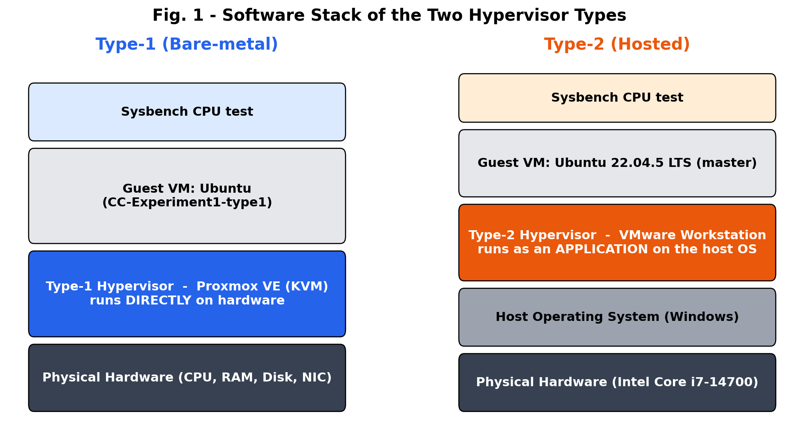</p>

Because a Type-2 hypervisor has an **extra layer** (the host OS), it is usually expected to be a little slower. This experiment **measures** whether that is true for CPU work.

---

## 2. Aim and Objectives

**Aim:** To create identically configured virtual machines on a Type-1 hypervisor (Proxmox VE) and a Type-2 hypervisor (VMware Workstation), and to measure and compare their CPU performance using Sysbench.

**Objectives:**

1. Access Proxmox VE through its web interface and create an Ubuntu VM.
2. Create an Ubuntu VM in VMware Workstation.
3. Verify each VM's system information, CPU, memory and disk (`hostnamectl`, `lscpu`, `free -h`, `df -h`, `top`).
4. Install Sysbench and run the CPU benchmark on both VMs.
5. Record events per second, total events, total time and latency.
6. Compare the results using tables and graphs, and explain the differences.

---

## 3. Basic Concepts

### 3.1 How a VM Runs CPU Instructions

Modern Intel and AMD processors include **hardware-assisted virtualisation** (Intel VT-x / AMD-V). With it, most guest instructions run **directly on the real CPU** at full speed. The hypervisor only steps in for special operations such as I/O, interrupts and privileged instructions. This is why `lscpu` inside the VMware VM reports **"Virtualization type: full"** and the `hypervisor` CPU flag.

So for a **pure calculation** workload like Sysbench CPU, both hypervisor types are expected to perform **almost the same**. The extra host-OS layer of Type-2 mostly affects **I/O, memory management and scheduling**, not raw arithmetic.

### 3.2 The Sysbench CPU Test

```bash
sysbench cpu --cpu-max-prime=20000 run
```

- Each **event** = checking every number up to 20,000 to find which ones are prime.
- The test runs for a **fixed 10 seconds** using **1 thread** (the Sysbench default).
- Sysbench then reports:

| Output | Meaning | Better if |
|:--|:--|:--|
| **Events per second** | How many prime-search tasks are finished per second (CPU speed) | Higher |
| **Total number of events** | Events finished in the 10 seconds | Higher |
| **Total time** | Length of the test (≈ 10 s, fixed) | — |
| **Latency min / avg / max** | Time taken by the fastest / typical / slowest single event | Lower |
| **95th percentile latency** | 95 % of events finished within this time | Lower |
| **Threads fairness** | How evenly work was shared between threads (1 thread here) | stddev = 0 |

---

## 4. Experimental Setup

### 4.1 Planned VM Configuration (from the Lab Manual)

| Resource | Type-1 (Proxmox VE) | Type-2 (VMware Workstation) |
|:--|:--|:--|
| VM name | `CC-Experiment1-Type1` | `CC-Experiment1-Type2` |
| Guest OS | Ubuntu (ISO) | Ubuntu 64-bit (ISO) |
| vCPU | 1 socket × 2 cores = **2 vCPU** | 1 processor × 2 cores = **2 vCPU** |
| Memory | 2048 MiB = **2 GB** | 2048 MB = **2 GB** |
| Disk | **20 GB** (local-lvm) | **20 GB** (single file) |
| Network | Bridge `vmbr0` (VirtIO) | NAT |

### 4.2 Actual Environment (from the Screenshots)

| Item | Type-1: Proxmox VE | Type-2: VMware Workstation |
|:--|:--|:--|
| Hypervisor access | Web UI / noVNC console at `https://10.11.0.252:8006` | VMware Workstation desktop app |
| Proxmox node / host | `admin1-HP-Pro-Tower-280-G9-E-PCI-Desktop-PC` (shared lab server) | Personal/lab PC, Intel Core i7-14700 |
| VM name / ID | `CC-Experiment1-type1` (VM ID 123) | Hostname `master` |
| Guest user | `janz-cc@janz` | `master@master` |
| Guest OS | Ubuntu (desktop) | **Ubuntu 22.04.5 LTS**, kernel 6.8.0-138-generic, x86-64 |
| vCPU seen by guest | Not captured | **8** (1 socket, 8 cores, 1 thread/core) |
| Memory seen by guest | Not captured | **7.7 GiB** RAM + 2.0 GiB swap |
| Root disk | Not captured | `/dev/sda3` 20 GB (12 GB used, 65 %) |
| Hypervisor reported | KVM (Proxmox console type `kvm`) | VMware, *full* virtualisation |
| Sysbench version | 1.0.20 | 1.0.20 (LuaJIT 2.1.0-beta3) |
| Benchmark command | `sysbench cpu --cpu-max-prime=20000 run` | same |

> **Note:** The VMware VM used in this experiment had **8 vCPU and ~8 GB RAM** instead of the planned 2 vCPU / 2 GB. The Sysbench CPU test uses **only 1 thread**, however, so the extra vCPUs and memory have **almost no effect** on the result. See [Section 11](#11-observations-and-limitations).

---

## 5. Methodology and Workflow

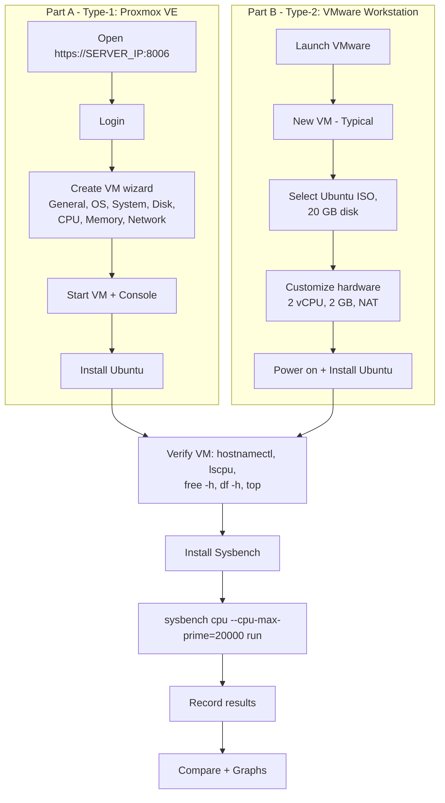

The same verification and benchmark steps were followed on both VMs, so the comparison is **fair at the guest level**.

---

## 6. Part A — Type-1 Hypervisor (Proxmox VE)

**Proxmox VE** is an open-source Type-1 virtualisation platform built on Debian Linux and **KVM** (Kernel-based Virtual Machine). It is installed **directly on the server hardware** and managed through a **web browser**.

### 6.1 Procedure

| Step | Action | Details |
|:-:|:--|:--|
| 1 | Open the web interface | `https://<PROXMOX_SERVER_IP>:8006` (here `10.11.0.252:8006`) |
| 2 | Accept the certificate warning | Proxmox uses a self-signed SSL certificate → **Advanced → Proceed** |
| 3 | Log in | Username, password and realm provided by the lab |
| 4 | Understand the layout | **Datacenter → Node → VMs / Storage / Network** |
| 5 | Open **Create VM** | Select the node, then click **Create VM** (top-right) |
| 6 | General | Node, VM ID (auto), Name = `CC-Experiment1-Type1` |
| 7 | OS | ISO image from `local` storage → Ubuntu ISO |
| 8 | System | Graphics, Machine, BIOS and SCSI controller left at **Default** |
| 9 | Disks | Storage `local-lvm`, size **20 GB** |
| 10 | CPU | Sockets **1**, Cores **2** → **2 vCPU** |
| 11 | Memory | **2048 MiB** (2 GB) |
| 12 | Network | Bridge **vmbr0**, model VirtIO |
| 13 | Confirm | Review the summary → **Finish** |
| 14–16 | Start + Console | Select the VM → **Start** → **Console** (opens in the browser via noVNC) |
| 17 | Install Ubuntu | Language → keyboard → install type → disk → timezone → user → restart |
| 18–22 | Verify VM | `hostnamectl`, `lscpu`, `free -h`, `df -h`, `top` |
| 23 | Install Sysbench | `sudo apt update` → `sudo apt install sysbench -y` → `sysbench --version` |
| 24 | Run benchmark | `sysbench cpu --cpu-max-prime=20000 run` |
| 26 | Monitor from Proxmox | **VM → Summary**: CPU, memory, network and disk graphs |
| 27 | Shut down | `sudo poweroff` or **Shutdown** in Proxmox |

### 6.2 Proxmox VM Hierarchy

```text
Datacenter
  |
  +-- admin1-HP-Pro-Tower-280-G9-E-PCI-Desktop-PC   (Proxmox node)
         |
         +-- local          (ISO images)
         +-- local-lvm      (VM disks)
         |
         +-- 123 (CC-Experiment1-type1)   <-- our VM
```

### 6.3 Benchmark Result — Type-1

```text
CPU speed:
    events per second:  1716.69

General statistics:
    total time:                          10.0004s
    total number of events:              17169

Latency (ms):
         min:                                    0.57
         avg:                                    0.58
         max:                                    2.78
         95th percentile:                        0.65
         sum:                                 9996.45

Threads fairness:
    events (avg/stddev):           17169.0000/0.00
    execution time (avg/stddev):   9.9965/0.00
```

### 6.4 Observation Table — Type-1 Hypervisor

| Parameter | Observation |
|:--|:--|
| Hypervisor | Proxmox VE |
| Hypervisor Type | Type-1 (bare-metal, KVM) |
| Guest Operating System | Ubuntu |
| CPU Allocation | 2 vCPU (as per manual) |
| Memory Allocation | 2 GB (as per manual) |
| Disk Allocation | 20 GB (as per manual) |
| Total Execution Time | **10.0004 s** |
| Total Events | **17,169** |
| Events per Second | **1716.69** |
| Minimum / Average / Maximum Latency | **0.57 / 0.58 / 2.78 ms** |
| 95th Percentile Latency | **0.65 ms** |

### 6.5 Screenshot

<p align="center">
  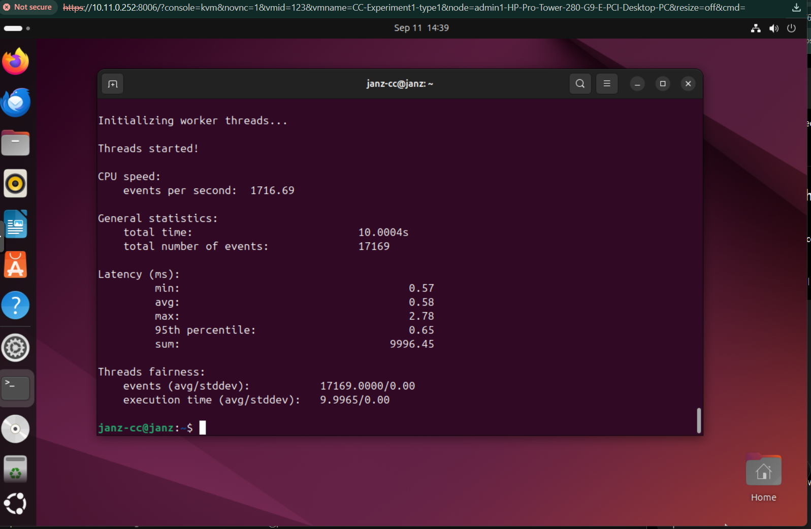<br>
  <em>Figure A.1 — Sysbench CPU result inside the Ubuntu VM <code>CC-Experiment1-type1</code> (VM ID 123), opened through the Proxmox VE noVNC console at <code>10.11.0.252:8006</code>: 1716.69 events/s.</em>
</p>

---

## 7. Part B — Type-2 Hypervisor (VMware Workstation)

**VMware Workstation** is a Type-2 hypervisor. It is installed like a normal program on a desktop operating system, and each VM appears as a window or tab on the host computer.

### 7.1 Procedure

| Step | Action | Details |
|:-:|:--|:--|
| 1 | Launch VMware Workstation | **Create a New Virtual Machine** |
| 2 | Configuration type | **Typical (recommended)** |
| 3 | Installation media | **Installer disc image file (iso)** → browse to the Ubuntu ISO |
| 4 | Guest OS | Linux → Ubuntu 64-bit |
| 5 | Name | `CC-Experiment1-Type2` + storage location |
| 6 | Disk | **20 GB**, single file |
| 7 | Customize Hardware | Memory **2048 MB**, Processors **1 × 2 cores**, Disk 20 GB, Network **NAT** |
| 8 | Finish | The VM appears in the VMware library |
| 9–11 | Power on + install | Language → keyboard → Normal installation → Erase disk (virtual disk only) → timezone → user → restart |
| 12–16 | Verify VM | `hostnamectl`, `lscpu`, `free -h`, `df -h`, `top` |
| 17 | Install Sysbench | `sudo apt update` → `sudo apt install sysbench -y` → `sysbench --version` |
| 18 | Run benchmark | `sysbench cpu --cpu-max-prime=20000 run` |
| 20 | Monitor | **VM → Settings** in VMware, plus `top` / `free -h` inside the guest |
| 22 | Shut down | `sudo poweroff` or **VM → Power → Shut Down Guest** |

### 7.2 VM Verification Output

**`hostnamectl`** confirms the machine is a VMware VM:

```text
 Static hostname: master
       Icon name: computer-vm
         Chassis: vm
  Virtualization: vmware
Operating System: Ubuntu 22.04.5 LTS
          Kernel: Linux 6.8.0-138-generic
    Architecture: x86-64
 Hardware Vendor: VMware, Inc.
  Hardware Model: VMware Virtual Platform
```

**`lscpu`** (key lines):

```text
Architecture:            x86_64
CPU(s):                  8
Model name:              Intel(R) Core(TM) i7-14700
Thread(s) per core:      1
Core(s) per socket:      8
Socket(s):               1
BogoMIPS:                4224.00
Flags:                   fpu vme ... sse4_2 x2apic ... avx ... hypervisor ... avx2 ... sha_ni ...
Virtualization features:
  Hypervisor vendor:     VMware
  Virtualization type:   full
```

**`free -h`** and **`df -h`**:

```text
               total        used        free      shared  buff/cache   available
Mem:           7.7Gi       2.0Gi       3.8Gi        71Mi       1.9Gi       5.4Gi
Swap:          2.0Gi          0B       2.0Gi

Filesystem      Size  Used Avail Use% Mounted on
/dev/sda3        20G   12G  6.5G  65% /
/dev/sda2       512M  6.1M  506M   2% /boot/efi
```

**`top`** (before the benchmark): load average **0.10, 0.19, 0.11**, CPU **97.0 % idle**, 361 tasks. The VM was **almost idle**, so background programs did not disturb the benchmark.

### 7.3 Benchmark Result — Type-2

```text
sysbench 1.0.20 (using system LuaJIT 2.1.0-beta3)

Running the test with following options:
Number of threads: 1
Prime numbers limit: 20000

CPU speed:
    events per second:  1758.60

General statistics:
    total time:                          10.0003s
    total number of events:              17588

Latency (ms):
         min:                                    0.55
         avg:                                    0.57
         max:                                    1.11
         95th percentile:                        0.61
         sum:                                 9993.49

Threads fairness:
    events (avg/stddev):           17588.0000/0.00
    execution time (avg/stddev):   9.9935/0.00
```

### 7.4 Observation Table — Type-2 Hypervisor

| Performance Metric | Result |
|:--|:--|
| Hypervisor | VMware Workstation |
| Hypervisor Type | Type-2 (hosted) |
| Guest Operating System | Ubuntu 22.04.5 LTS |
| CPU Configuration | 8 vCPU visible (benchmark used 1 thread) |
| Memory Configuration | 7.7 GiB |
| Disk Configuration | 20 GB |
| Total Execution Time | **10.0003 s** |
| Total Events | **17,588** |
| Events per Second | **1758.60** |
| Minimum Latency | **0.55 ms** |
| Average Latency | **0.57 ms** |
| Maximum Latency | **1.11 ms** |
| 95th Percentile Latency | **0.61 ms** |

### 7.5 Screenshots

<p align="center">
  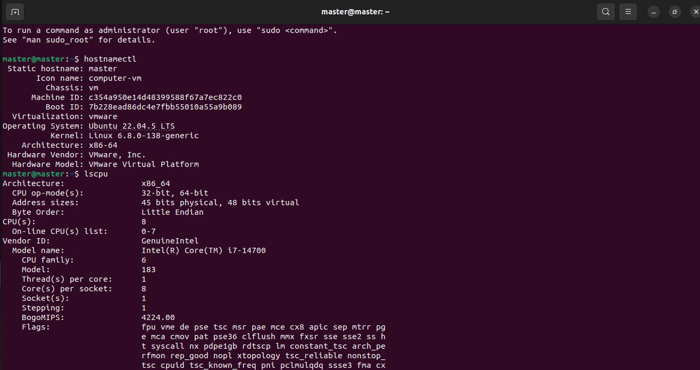<br>
  <em>Figure B.1 — <code>hostnamectl</code> (Virtualization: vmware, Ubuntu 22.04.5 LTS) and the start of <code>lscpu</code>.</em>
</p>

<p align="center">
  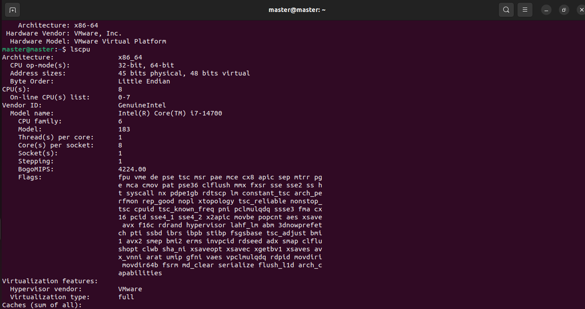<br>
  <em>Figure B.2 — <code>lscpu</code>: 8 vCPUs, Intel Core i7-14700, Hypervisor vendor VMware, Virtualization type full.</em>
</p>

<p align="center">
  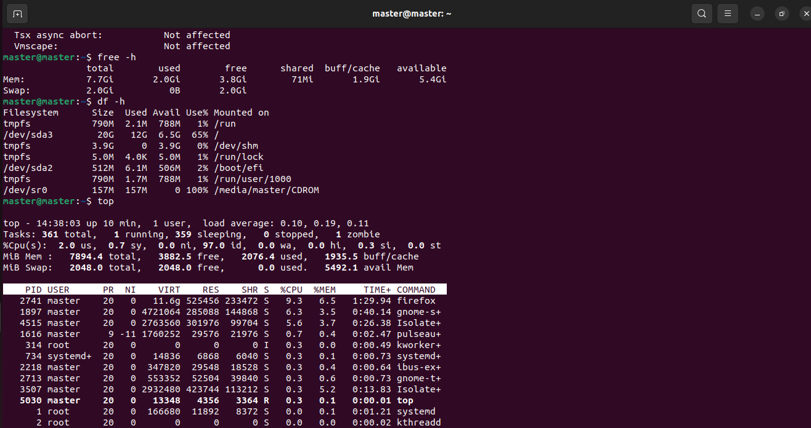<br>
  <em>Figure B.3 — <code>free -h</code> (7.7 GiB RAM), <code>df -h</code> (20 GB root disk, 65 % used) and <code>top</code> (97 % idle).</em>
</p>

<p align="center">
  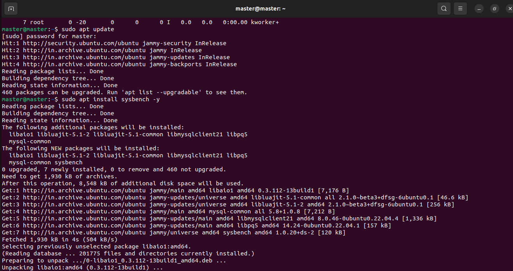<br>
  <em>Figure B.4 — <code>sudo apt update</code> and <code>sudo apt install sysbench -y</code> (sysbench 1.0.20+ds-2 from the Ubuntu jammy repository).</em>
</p>

<p align="center">
  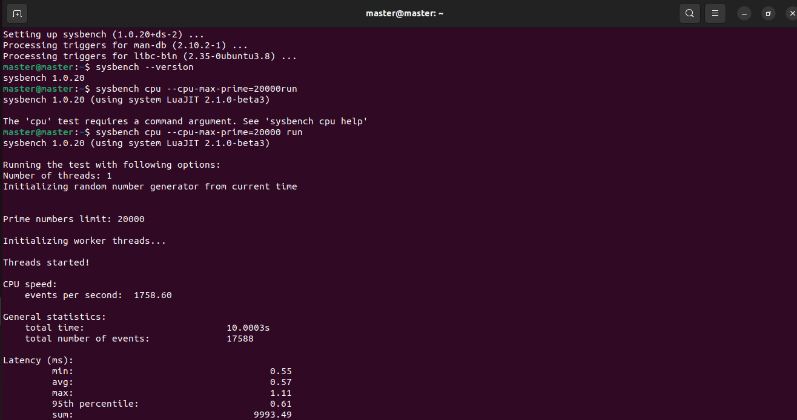<br>
  <em>Figure B.5 — <code>sysbench --version</code> (1.0.20), the first command typo (missing space before <code>run</code>) and the corrected benchmark run.</em>
</p>

<p align="center">
  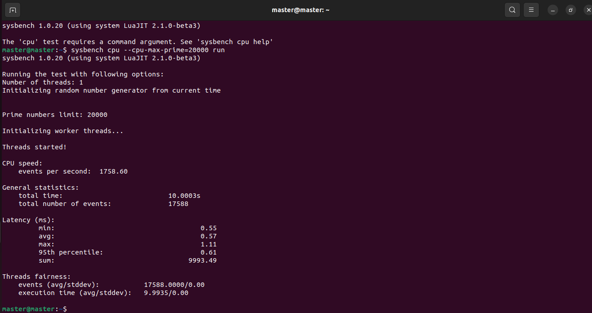<br>
  <em>Figure B.6 — Complete Sysbench CPU result on VMware Workstation: 1758.60 events/s, 17,588 events.</em>
</p>

---

## 8. Consolidated Results

| Metric | Type-1: Proxmox VE | Type-2: VMware Workstation | Difference (Type-2 vs Type-1) | Better |
|:--|--:|--:|--:|:-:|
| Events per second | 1716.69 | **1758.60** | +41.91 (**+2.44 %**) | Type-2 |
| Total events (10 s) | 17,169 | **17,588** | +419 (+2.44 %) | Type-2 |
| Total time (s) | 10.0004 | 10.0003 | ≈ 0 | Equal |
| Time per event (ms) | 0.5825 | **0.5686** | −0.0139 (−2.38 %) | Type-2 |
| Min latency (ms) | 0.57 | **0.55** | −0.02 | Type-2 |
| Average latency (ms) | 0.58 | **0.57** | −0.01 (−1.7 %) | ≈ Equal |
| 95th percentile (ms) | 0.65 | **0.61** | −0.04 (−6.2 %) | Type-2 |
| Max latency (ms) | 2.78 | **1.11** | −1.67 (−60.1 %) | Type-2 |
| Threads fairness (stddev) | 0.00 | 0.00 | — | Equal |

Raw data: [`results/sysbench_results.csv`](results/sysbench_results.csv) · [`results/type2_vm_resources.csv`](results/type2_vm_resources.csv)

**How the derived values are calculated:**

$$
\text{Difference \%} = \frac{1758.60 - 1716.69}{1716.69} \times 100 = 2.44\%
\qquad
\text{Time per event} = \frac{\text{total time}}{\text{total events}} = \frac{10.0004\ \text{s}}{17169} = 0.5825\ \text{ms}
$$

---

## 9. Performance Analysis

All graphs are generated with **matplotlib** by [`scripts/generate_graphs.py`](scripts/generate_graphs.py) from the CSV files in `results/`.

### 9.1 CPU Throughput (Events per Second)

<p align="center">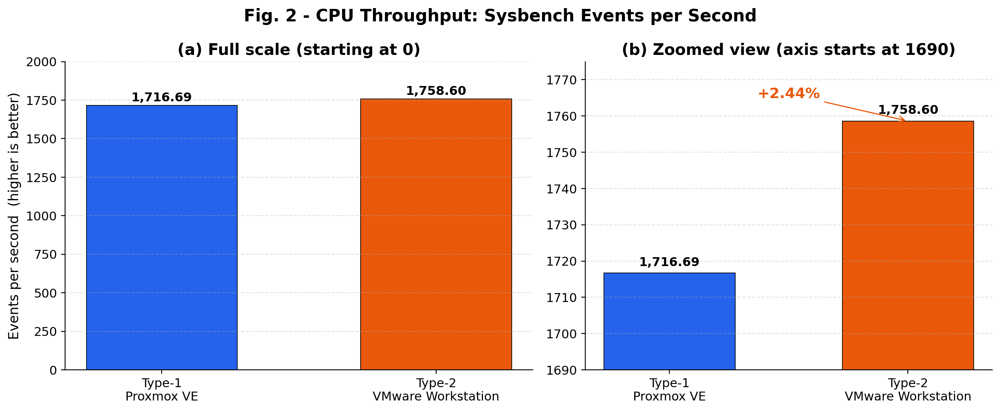</p>

**What the graph shows:**

- On the **full scale** (a), the two bars look **almost the same height**. Both hypervisors deliver about **1,700–1,760 prime-search events per second**.
- The **zoomed view** (b) shows that VMware Workstation was **2.44 % higher**.
- A 2–3 % difference is **small**. It is the same size as the variation you could see between two runs on the same machine, or between two different CPU models.

### 9.2 Work Completed in 10 Seconds

<p align="center">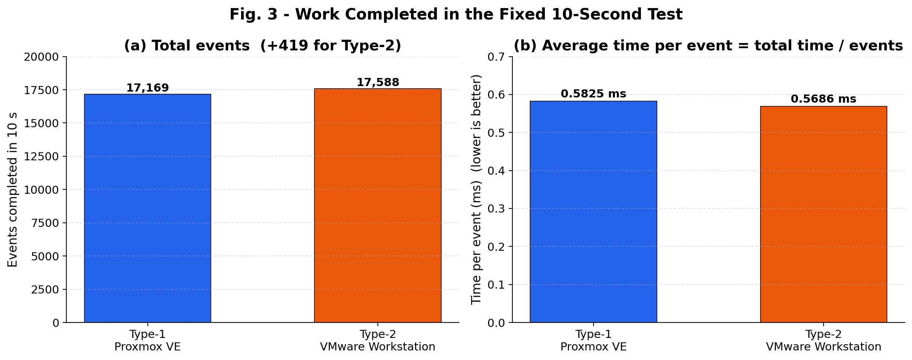</p>

**What the graph shows:**

- In the same 10-second window, the Type-2 VM completed **419 more events** (17,588 vs 17,169).
- Each event took **0.5825 ms** on Type-1 and **0.5686 ms** on Type-2, a difference of only **0.014 ms (14 microseconds)** per event.

### 9.3 Latency Statistics

<p align="center">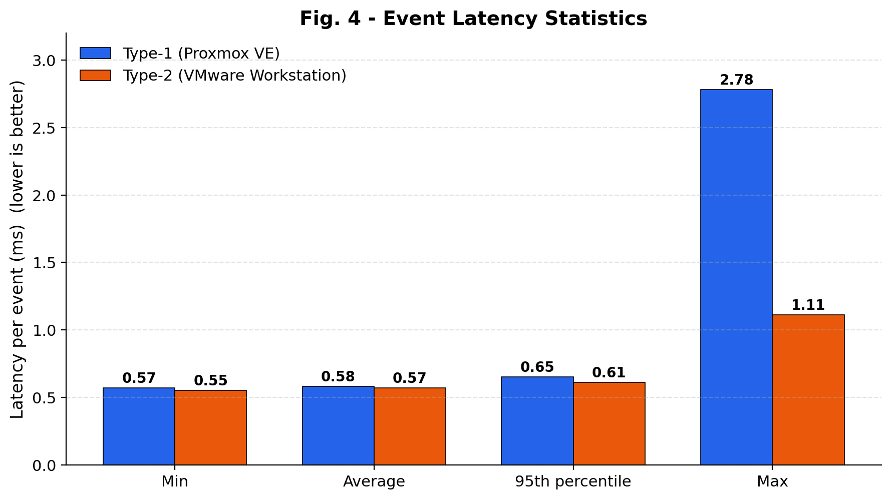</p>

**What the graph shows:**

- **Min, average and 95th-percentile** latencies are **nearly identical** (0.55–0.65 ms). The *typical* event takes the same time on both hypervisors.
- The big difference is the **maximum latency**: **2.78 ms on Proxmox** vs **1.11 ms on VMware**. At least one event on the Type-1 VM was **delayed** to about 5× its normal time.

### 9.4 Latency Consistency (Jitter)

<p align="center">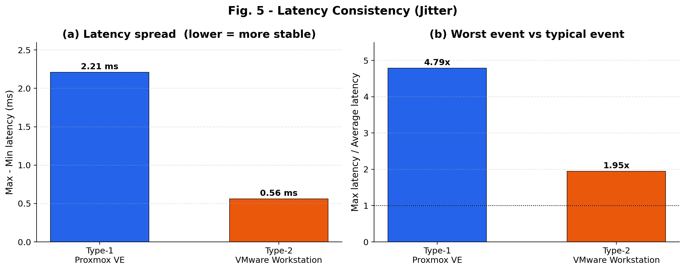</p>

**What the graph shows:**

- **Spread (max − min):** 2.21 ms for Type-1 vs 0.56 ms for Type-2.
- **Worst vs typical event:** the slowest Type-1 event took **4.79×** the average, compared with **1.95×** for Type-2.
- The average and 95th-percentile values are almost equal, so these delays were **rare spikes**, not a general slowdown. Likely causes:
  - The Proxmox server is a **shared lab server** (VM ID 123 suggests many VMs exist on it). Other users' VMs compete for the same physical CPU, so our VM is **occasionally paused** for a moment.
  - The VM was operated through a **web console (noVNC)**, which keeps the VM's graphics and network busy during the test.

### 9.5 Relative Performance

<p align="center">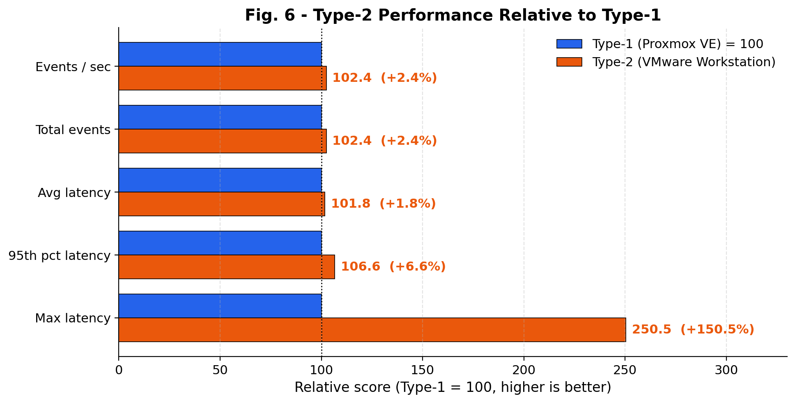</p>

**What the graph shows:** with Type-1 set to 100 on every metric (higher = better), Type-2 scores **101.8–106.6** on the throughput and typical-latency metrics, and **250.5** on maximum latency. So the two are **practically equal** on average speed, and the main difference is in **occasional delays**.

### 9.6 Type-2 VM Resource Snapshot

<p align="center">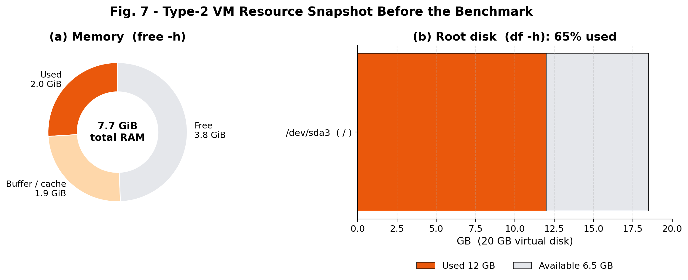</p>

**What the graph shows:**

- **Memory:** 7.7 GiB total, with only 2.0 GiB in use and 5.4 GiB available. There was **no memory pressure** during the test.
- **Disk:** the 20 GB virtual disk was 65 % used (12 GB), mostly by the Ubuntu desktop installation.
- `top` showed **97 % idle CPU** and a load average of **0.10**, so the VM was **quiet** before the benchmark started.

### 9.7 Why Is the Type-2 Hypervisor Not Slower Here?

Theory says Type-1 should be faster because it has **one less software layer**. The measured result is the opposite (by 2.44 %). The main reasons are:

| Reason | Simple explanation |
|:--|:--|
| **Hardware-assisted virtualisation** | With Intel VT-x, guest CPU instructions run **directly on the real processor** under both hypervisors. A prime-number loop rarely needs the hypervisor, so the extra host-OS layer of Type-2 is almost never used. |
| **Different physical CPUs** | The two VMs ran on **different computers**. The VMware VM ran on an **Intel Core i7-14700** (a recent 20-core desktop CPU with a high turbo clock), while the Proxmox VM ran on a separate lab server (`HP Pro Tower 280 G9`). Small speed differences between CPUs can easily outweigh a 2 % gap. |
| **Shared vs dedicated host** | The Proxmox server is shared by many students' VMs. The VMware host ran our VM **with little else running**. |
| **Virtual CPU model** | Proxmox often gives VMs a **generic virtual CPU model** for compatibility, while VMware passed through the real CPU name (i7-14700) and its features. This can make a small difference. |
| **Single short run** | Each hypervisor was tested **once for 10 s**, so a ±2 % difference is within normal measurement noise. |

**Key point:** for **CPU-bound** work, modern Type-1 and Type-2 hypervisors run at **nearly native speed**. The advantages of Type-1 show up in other areas: **I/O performance, running many VMs at once, stability, security, remote management and scalability**. That is why cloud providers use Type-1.

### 9.8 Summary Dashboard

<p align="center">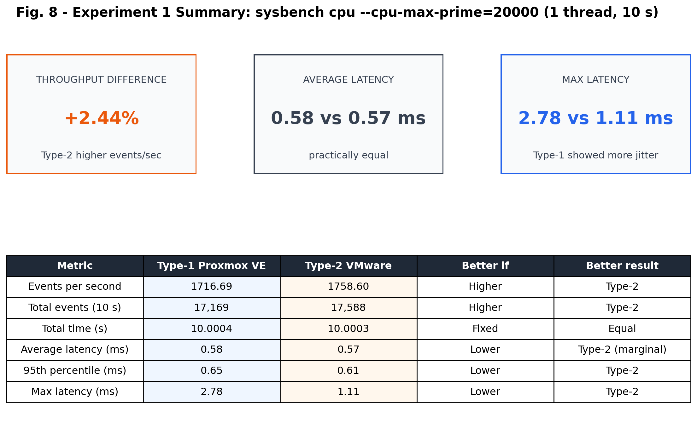</p>

---

## 10. Type-1 vs Type-2 — Comparison

| Criterion | Type-1: Proxmox VE | Type-2: VMware Workstation |
|:--|:--|:--|
| Installed on | Bare-metal server | Windows desktop (as an application) |
| Access method | Web browser (`https://IP:8006`) + noVNC console | Local desktop window |
| VM creation | Web wizard (General → OS → System → Disks → CPU → Memory → Network → Confirm) | Desktop wizard (Typical → ISO → Name → Disk → Customize Hardware → Finish) |
| Default network | Bridge `vmbr0` (VM gets an address on the lab network) | NAT (VM shares the host's connection) |
| **Measured events/sec** | 1716.69 | **1758.60** (+2.44 %) |
| **Measured avg latency** | 0.58 ms | 0.57 ms |
| **Measured max latency** | 2.78 ms | **1.11 ms** |
| Overhead layers | Hypervisor only | Hypervisor + host OS |
| Many users / many VMs | ✅ Designed for it (clusters, multi-user, HA, live migration) | ❌ Single user, single PC |
| Remote management | ✅ Built-in web UI and API | ❌ Mostly local |
| Ease of setup | Needs a dedicated server | Install like any app |
| Best suited for | **Cloud / data-centre / production** | **Learning, testing, development** |

---

## 11. Observations and Limitations

**Observations:**

1. Both VMs ran the benchmark successfully and gave **very similar CPU throughput**: **1716.69 vs 1758.60 events/s**, a 2.44 % difference.
2. **Typical latency was the same** (~0.57–0.58 ms per event) on both hypervisors.
3. The Type-1 VM showed **occasional latency spikes** (max 2.78 ms), most likely because it ran on a shared lab server.
4. `hostnamectl` and `lscpu` clearly show that the guest **knows it is virtualised** (`Virtualization: vmware`, `Hypervisor vendor: VMware`, `Virtualization type: full`).
5. With 1 thread, **thread fairness was perfect** (stddev 0.00) in both runs.

**Limitations of this comparison:**

| Limitation | Effect |
|:--|:--|
| **Different physical machines** | The VMs did not share the same hardware, so part of the difference comes from the CPUs, not only from the hypervisor type. |
| **VM size not identical** | The VMware VM had 8 vCPU / 7.7 GiB instead of the planned 2 vCPU / 2 GB. With a 1-thread test this has little impact, but a multi-threaded test would be affected. |
| **Type-1 VM details not captured** | `lscpu`, `free -h` and `df -h` screenshots were only taken for the Type-2 VM. |
| **One run per hypervisor** | Running the test 3–5 times and averaging would give more reliable numbers. |
| **CPU test only** | Memory (`sysbench memory`), disk (`sysbench fileio`) and network tests would show the I/O advantages of Type-1 more clearly. |

**Suggested improvement:** run both hypervisors on the **same physical machine**, with exactly **2 vCPU / 2 GB**, repeat each test 5 times, and also test multiple threads (`--threads=2`), memory and disk I/O.

---

## 12. Troubleshooting and Issues Encountered

### 12.1 Issues Actually Encountered During This Experiment

| Issue | Seen in | Cause | Fix |
|:--|:--|:--|:--|
| `The 'cpu' test requires a command argument. See 'sysbench cpu help'` | Fig. B.5 | Typo: `--cpu-max-prime=20000run` (no space before `run`) | Re-ran as `sysbench cpu --cpu-max-prime=20000 run` |
| Browser "Not secure" warning on the Proxmox page | Fig. A.1 | Proxmox uses a self-signed SSL certificate | **Advanced → Proceed to <server IP>** (expected and safe in the lab) |

### 12.2 General Troubleshooting Guide

| Problem | Solution |
|:--|:--|
| Cannot open `https://<IP>:8006` | Check that you are on the same network as the Proxmox server, and use `https` and port `8006` |
| Proxmox login fails | Check the username, password and **Realm** (PAM vs Proxmox VE authentication) |
| VM does not boot from ISO | Check that the ISO is attached (Proxmox: Hardware → CD/DVD; VMware: Settings → CD/DVD "Connect at power on") |
| VMware shows "VT-x is disabled" | Enable Intel VT-x / AMD-V in the BIOS and disable conflicting Windows features if needed |
| `sudo apt install sysbench` fails | Run `sudo apt update` first, and check the VM's internet access (NAT / bridge) |
| `sysbench: command not found` | Installation did not finish. Re-run `sudo apt install sysbench -y` |
| Benchmark results vary a lot | Close other programs, make sure `top` shows the VM idle, and run the test several times |

---

## 13. Important Terms

| Term | Meaning |
|:--|:--|
| **Virtualisation** | Running several virtual computers on one physical computer |
| **Hypervisor / VMM** | Software that creates and runs virtual machines and shares the hardware between them |
| **Type-1 hypervisor** | Runs directly on the hardware (bare-metal), e.g. Proxmox VE, ESXi, Hyper-V |
| **Type-2 hypervisor** | Runs as an application on a host operating system, e.g. VMware Workstation, VirtualBox |
| **Host** | The physical machine (and, for Type-2, its operating system) |
| **Guest** | The operating system running inside the VM |
| **vCPU** | A virtual CPU core given to a VM |
| **KVM** | Kernel-based Virtual Machine, the Linux hypervisor used by Proxmox VE |
| **VT-x / AMD-V** | CPU features that let VMs run instructions directly on the real processor |
| **Bridge (vmbr0)** | Virtual network switch that connects VMs directly to the physical network |
| **NAT** | VM shares the host's network address to reach the internet |
| **Sysbench** | An open-source benchmarking tool for CPU, memory, disk and database tests |
| **Event** | One unit of Sysbench work (one full prime-number search up to 20,000) |
| **Latency** | Time taken to finish one event |
| **95th percentile** | 95 % of events were completed within this time |
| **Jitter** | Variation in latency. High jitter means occasional slow events |

---

## 14. Conclusion

In this experiment, Ubuntu virtual machines were created on a **Type-1 hypervisor (Proxmox VE)**, through its web interface, and on a **Type-2 hypervisor (VMware Workstation)**, through its desktop wizard. Both VMs were verified with standard Linux commands and benchmarked with **Sysbench CPU**.

- **CPU throughput was almost the same:** 1716.69 events/s on Proxmox VE and 1758.60 events/s on VMware Workstation, a gap of only **2.44 %**.
- **Typical latency was identical** (~0.57–0.58 ms per event). The Proxmox VM showed **rare latency spikes** (max 2.78 ms), most likely because it ran on a **shared lab server**.
- Type-2 was slightly faster in this run, which differs from the usual expectation. This is explained by **hardware-assisted virtualisation** (guest CPU instructions run directly on the processor under both hypervisors), combined with the fact that the two VMs ran on **different physical CPUs** and the Proxmox server was **shared**.
- **For pure CPU work, the hypervisor type makes very little difference.** Type-1 hypervisors remain the choice for **cloud and data-centre** use because of their efficiency with **many VMs, I/O performance, remote management, security and scalability**, not because of single-VM CPU speed. Type-2 hypervisors are ideal for **personal learning, development and testing**.

---

## 15. Repository Structure and Reproduction

```text
CC_Experiment_1/
├── README.md                          ← this report
├── Type1/                             ← Proxmox VE screenshot
│   └── type1_hypervisor.png
├── Type2/                             ← VMware Workstation screenshots
│   ├── hostnamectl.png
│   ├── lscpu.png
│   ├── free_h.png
│   ├── Sysbench_install.png
│   ├── Sysbench_ver.png
│   └── Sysbench_cpu.png
├── results/
│   ├── sysbench_results.csv           ← benchmark numbers for both hypervisors
│   └── type2_vm_resources.csv         ← memory and disk snapshot (free -h, df -h)
├── scripts/
│   ├── benchmark_commands.sh          ← commands run inside each guest VM
│   └── generate_graphs.py             ← matplotlib graph generator
└── graphs/                            ← 8 generated figures
```

**Reproduce the benchmark (inside each Ubuntu VM):**

```bash
bash scripts/benchmark_commands.sh
# or step by step:
hostnamectl && lscpu && free -h && df -h
sudo apt update && sudo apt install sysbench -y
sysbench --version
sysbench cpu --cpu-max-prime=20000 run
```

**Regenerate the graphs:**

```bash
pip install matplotlib pandas numpy
python scripts/generate_graphs.py
```

---

## 16. References

1. Proxmox Server Solutions GmbH, *Proxmox VE Administration Guide*.
2. VMware (Broadcom), *VMware Workstation Pro Documentation*.
3. A. Kopytov, *Sysbench — Scriptable Database and System Performance Benchmark*, GitHub: akopytov/sysbench.
4. G. J. Popek and R. P. Goldberg, "Formal requirements for virtualizable third generation architectures," *Communications of the ACM*, vol. 17, no. 7, pp. 412–421, 1974.
5. Intel Corporation, *Intel Virtualization Technology (Intel VT) — Overview*.
6. R. Buyya, C. Vecchiola and S. T. Selvi, *Mastering Cloud Computing*, McGraw-Hill, 2013 (Chapter 3: Virtualization).
7. *Lab Manual — Performance Analysis of Type-1 and Type-2 Hypervisors: Proxmox VE vs VMware Workstation*, Cloud Computing Laboratory.

---

<div align="center"><sub>Experiment 1 · Cloud Computing Laboratory</sub></div>
