<div align="center">

# Experiment 2 — Performance Analysis of Virtual Machines and Containers
### Ubuntu VM on VMware Workstation vs Docker Containers

**Course:** Cloud Computing Laboratory
**Tools:** Sysbench · fio · Docker · FastAPI · Apache Bench · wrk · Python (Pandas / Matplotlib)
**Environment:** Windows host → VMware Workstation → Ubuntu 22.04 VM (4 vCPU, 7.7 GiB) → Docker 29.1.3


</div>

---

## Abstract

Virtual machines (VMs) and containers are the two main ways of running applications in the cloud. A **VM** virtualises the whole computer and runs its own operating-system kernel. A **container** shares the kernel of the system it runs on and packages only the application and its libraries.

In this experiment, an Ubuntu 22.04 VM was created in VMware Workstation with **4 vCPU and 7.7 GiB RAM**. Docker was installed inside it, and benchmark images were built for the container tests. The following were performed:

- a CPU baseline;
- a CPU scalability test with 1, 2, 4 and 8 threads, done twice;
- disk I/O tests inside a container with fio, done twice;
- building and starting a FastAPI web application in a container.

**Results:**

- **CPU:** the VM scaled almost perfectly up to its 4 vCPUs. Average throughput rose from **1,746 events/s (1 thread)** to **6,722 events/s (4 threads)**, a **3.85× speedup**. At 8 threads, throughput **fell slightly** to 6,457 events/s and average latency **doubled** (0.59 → 1.24 ms), because 8 threads had to share 4 vCPUs.
- **Repeatability:** four 4-thread measurements varied by only **1.52 %** (coefficient of variation).
- **Disk (container):** sequential write reached **1,499–1,702 MB/s**, and 4 KiB random read reached **~14,700 IOPS (60 MB/s)** with a median latency of **~65 µs**.

Memory, network, API-throughput and startup-time results were **not captured** in the screenshots. The report clearly marks these gaps and explains how to complete them.

---

## Table of Contents

1. [Introduction](#1-introduction)
2. [Aim and Objectives](#2-aim-and-objectives)
3. [Basic Concepts](#3-basic-concepts)
4. [Experimental Setup](#4-experimental-setup)
5. [Methodology and Workflow](#5-methodology-and-workflow)
6. [Part A — Environment Preparation](#6-part-a--environment-preparation)
7. [Part B — Baseline CPU Measurement](#7-part-b--baseline-cpu-measurement)
8. [Part C — Docker Benchmark Image and CPU Experiment](#8-part-c--docker-benchmark-image-and-cpu-experiment)
9. [Part D — Disk I/O Experiment (Container)](#9-part-d--disk-io-experiment-container)
10. [Part E — FastAPI Application, API Benchmark and Startup Time](#10-part-e--fastapi-application-api-benchmark-and-startup-time)
11. [Part F — Scalability Experiment (Second Run)](#11-part-f--scalability-experiment-second-run)
12. [Part G — Automation, Analysis and GitHub](#12-part-g--automation-analysis-and-github)
13. [Consolidated Results](#13-consolidated-results)
14. [Performance Analysis](#14-performance-analysis)
15. [VM vs Container — Comparison](#15-vm-vs-container--comparison)
16. [Observations and Limitations](#16-observations-and-limitations)
17. [Troubleshooting and Issues Encountered](#17-troubleshooting-and-issues-encountered)
18. [Important Terms](#18-important-terms)
19. [Conclusion and Future Work](#19-conclusion-and-future-work)
20. [Repository Structure and Reproduction](#20-repository-structure-and-reproduction)
21. [References](#21-references)

---

## 1. Introduction

Cloud platforms run applications in two main ways:

| | **Virtual Machine (VM)** | **Container** |
|:--|:--|:--|
| What is virtualised | The whole computer (CPU, memory, disk, network) | Only the application's environment |
| Kernel | Each VM has its **own** guest kernel | All containers **share** the host kernel |
| Created by | Hypervisor (VMware, KVM, Hyper-V) | Container engine (Docker, containerd) |
| Typical size | Gigabytes (full OS) | Megabytes (app + libraries) |
| Start-up time | Tens of seconds to minutes (OS boot) | Usually under a second to a few seconds |
| Isolation | Strong (separate kernel) | Process-level (namespaces + cgroups) |
| Example | Ubuntu VM in VMware Workstation | `docker run vm-container-benchmark` |

<p align="center">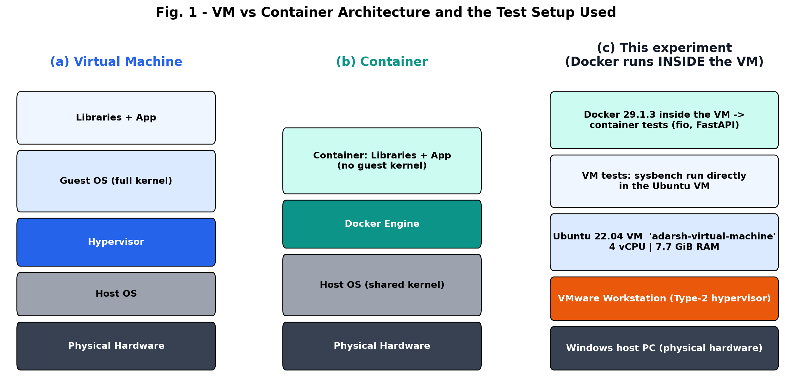</p>

Panel (c) shows the setup actually used here. **Docker was installed inside the Ubuntu VM**, so every container ran on top of the VM's kernel. This is how containers are commonly run in the cloud, for example Docker on an AWS EC2 VM. It also means that a "container" result in this experiment shows the extra cost of Docker **on top of** a VM, not Docker on bare metal.

---

## 2. Aim and Objectives

**Aim:** To experimentally compare the performance, resource usage, application behaviour and scalability of a Virtual Machine and Docker Containers under identical workloads.

**Objectives** (from the lab manual):

1. Prepare and record the experimental environment (hardware, OS, tools).
2. Build a reusable **benchmark Docker image** (`vm-container-benchmark`).
3. Measure a **CPU baseline** with Sysbench.
4. Measure **CPU performance and scalability** (1, 2, 4 and 8 threads).
5. Measure **memory** (Sysbench), **disk I/O** (fio) and **network** (iperf3) performance.
6. Build a **FastAPI** application, containerise it (`performance-api`) and benchmark it with Apache Bench and wrk.
7. Measure **start-up time**.
8. Automate the benchmarks, process the results with Python, draw graphs and publish everything on **GitHub**.

---

## 3. Basic Concepts

### 3.1 Benchmark Tools Used

| Tool | Measures | Key output | Better if |
|:--|:--|:--|:--|
| **sysbench cpu** | CPU speed (prime numbers up to 20,000) | Events per second, latency | Higher events/s, lower latency |
| **sysbench memory** | Memory transfer speed | MiB/s, operations/s | Higher |
| **fio** | Disk speed | MB/s (throughput), IOPS, latency (µs) | Higher MB/s and IOPS, lower latency |
| **iperf3** | Network speed | Mbit/s, retransmissions | Higher Mbit/s, fewer retransmissions |
| **ab / wrk** | Web application speed | Requests/s, time per request | Higher req/s, lower latency |
| **time** | Start-up time | Seconds | Lower |

### 3.2 Formulas Used

| Metric | Formula |
|:--|:--|
| Speedup | $S_n = \dfrac{\text{events/s with } n \text{ threads}}{\text{events/s with 1 thread}}$ |
| Efficiency | $E_n = \dfrac{S_n}{n} \times 100\%$ |
| Throughput difference (manual Step 24) | $\dfrac{\text{container} - \text{VM}}{\text{VM}} \times 100\%$ |
| Coefficient of variation (CV) | $\dfrac{\text{standard deviation}}{\text{mean}} \times 100\%$ |

---

## 4. Experimental Setup

### 4.1 Environment (from the screenshots)

| Item | Value |
|:--|:--|
| Host | Windows PC with VMware Workstation (Type-2 hypervisor) |
| VM hostname / user | `adarsh-virtual-machine` / `adarsh` |
| Guest OS | Ubuntu 22.04 LTS ("jammy" repositories) |
| vCPU | **4** (`nproc` = 4; 2 sockets × 2 cores) |
| Memory | **7.7 GiB** RAM + 3.8 GiB swap |
| Docker | **29.1.3** (build 29.1.3-0ubuntu3~22.04.2), installed **inside the VM** |
| Benchmark image | `vm-container-benchmark` (base `ubuntu:24.04`, contains sysbench, fio, iperf3, python3) |
| API image | `performance-api` (base `python:3.12-slim`, FastAPI 0.141.1, Uvicorn 0.54.0, Starlette 1.7.0) |
| Tool versions | sysbench 1.0.20 (LuaJIT 2.1.0-beta3), fio 3.36, ApacheBench 2.3, wrk 4.1.0 |
| Analysis | pandas, matplotlib 3.10.9, numpy 2.2.6 |
| Project root | `~/vm-vs-container-performance` |

### 4.2 Recommended vs Actual Configuration

| Resource | Manual recommendation | Actual VM | Container limit used |
|:--|:--|:--|:--|
| CPU | 4 vCPU | **4 vCPU** ✅ | `--cpus=4` (CPU loop command) |
| Memory | 8 GB | **7.7 GiB** ✅ (≈ 8 GB) | `--memory=8g` |
| Disk | 60 GB | Not recorded | Host directory mounted with `-v` |
| Guest OS | Ubuntu 24.04 LTS | Ubuntu **22.04** LTS | Image base `ubuntu:24.04` |
| Network | NAT or Bridged | Not recorded | Port mapping `-p 8000:8000` |

---

## 5. Methodology and Workflow


```mermaid
flowchart LR
    A[Prepare environment<br/>tools + Docker] --> B[Baseline CPU<br/>4 threads, 30 s]
    B --> C[Benchmark image<br/>vm-container-benchmark]
    C --> D[CPU experiment<br/>1/2/4/8 threads]
    D --> E[Disk I/O<br/>fio in container]
    E --> F[FastAPI app<br/>performance-api]
    F --> G[API benchmark + startup]
    G --> H[Scalability<br/>2nd CPU run]
    H --> I[Automation +<br/>Python analysis]
    I --> J[GitHub]
    style B fill:#DBEAFE
    style D fill:#DBEAFE
    style H fill:#DBEAFE
    style E fill:#CCFBF1
    style F fill:#CCFBF1
```

**Screenshot ordering.** The 25 screenshots were taken out of order: two during the run, and the rest afterwards by scrolling back through the terminal. They were put back into **execution order** using:

- the commands visible in each image;
- overlapping output between consecutive images;
- fio's own timestamps (`Tue Sep 29 09:32 / 09:34 UTC`, which is 15:02–15:05 IST).

They were then renamed `01_…` to `25_…` in the [`screenshots/`](screenshots) folder.

---

## 6. Part A — Environment Preparation

**Manual Steps 2–5.** Every command was typed in the Ubuntu terminal inside the VMware VM, from the project root `~/vm-vs-container-performance`.

| Step | Command | Purpose | Result |
|:-:|:--|:--|:--|
| 1 | `nproc`, `free -h`, `lscpu \| grep …` | Record CPU and memory | 4 vCPU, 7.7 GiB RAM |
| 2 | `sudo apt install -y docker.io` | Install Docker | Installed with containerd, runc, bridge-utils |
| 3 | `sudo systemctl enable --now docker` | Start Docker at boot | ✅ |
| 4 | `sudo docker run --rm hello-world` | Test Docker | "Hello from Docker!" ✅ |
| 5 | `docker --version` / `sudo docker images` | Verify | Docker 29.1.3, `hello-world:latest` (9.49 kB) |
| 6 | `sudo apt install -y sysbench fio iperf3 htop iotop sysstat python3 python3-pip git curl` | Benchmark tools | ✅ |
| 7 | `sysbench --version`, `fio --version`, … | Verify tools | sysbench 1.0.20, fio 3.36 |

<p align="center">
  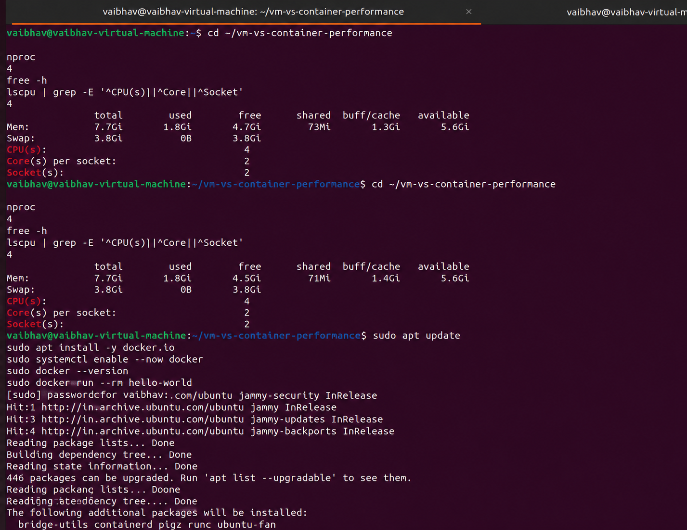<br>
  <em>Screenshot 01 — <code>nproc</code> = 4, <code>free -h</code> = 7.7 GiB, <code>lscpu</code> (2 sockets × 2 cores) and the start of the Docker installation.</em>
</p>

<p align="center">
  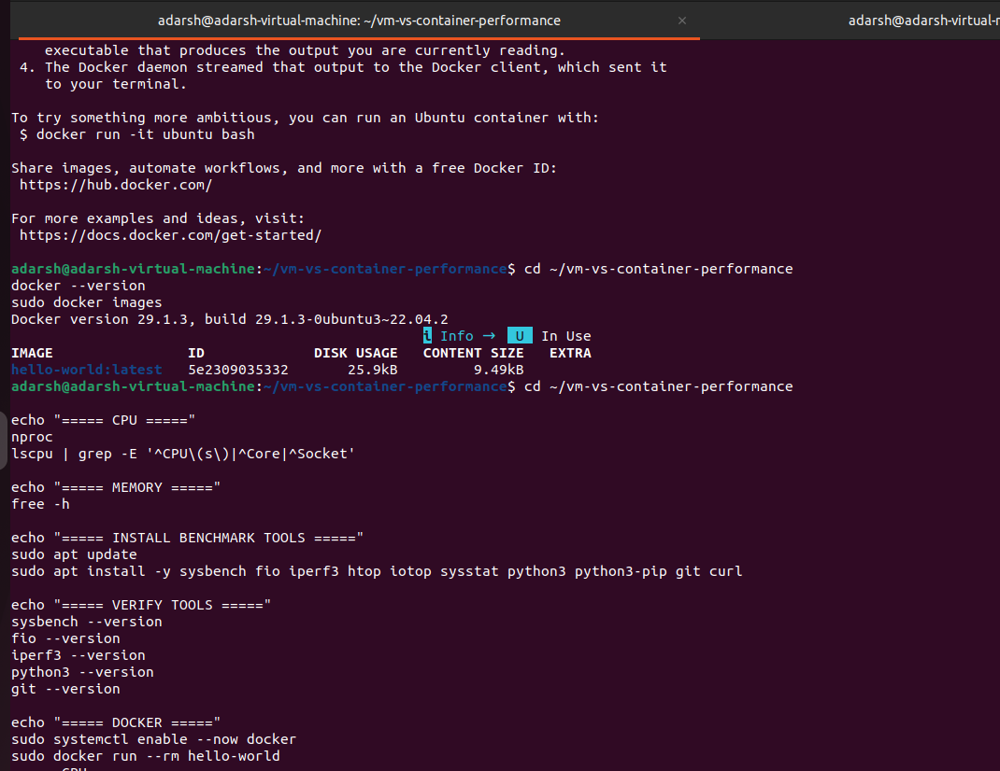<br>
  <em>Screenshot 02 — End of the <code>hello-world</code> output, <code>docker --version</code> (29.1.3), <code>docker images</code>, and the combined setup script.</em>
</p>

<p align="center">
  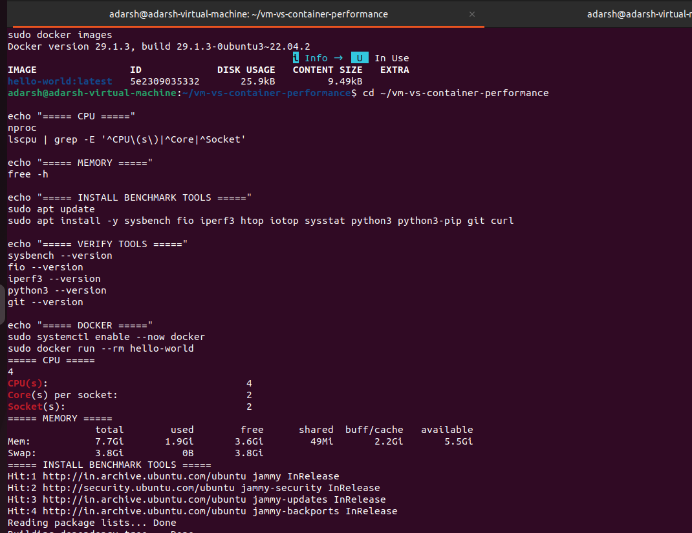<br>
  <em>Screenshot 03 — Setup script output: CPU and memory check, then installation of the benchmark tools.</em>
</p>

---

## 7. Part B — Baseline CPU Measurement

**Manual Step 7.** A baseline is a **reference measurement** taken with the same workload that is used later.

```bash
mkdir -p results/raw/baseline
sysbench cpu --cpu-max-prime=20000 --threads=4 --time=30 run                              # shown live
sysbench cpu --cpu-max-prime=20000 --threads=4 --time=30 run > results/raw/baseline/cpu.txt  # saved
cat results/raw/baseline/cpu.txt
```

| Measurement | Events/s | Total events (30 s) | Latency min / avg / max / 95th (ms) | Events per thread (avg / stddev) |
|:--|--:|--:|:--|:--|
| Baseline — live terminal run | **6,736.23** | 202,098 | 0.57 / 0.59 / 7.64 / 0.64 | 50,524.5 / 428.45 |
| Baseline — saved to `cpu.txt` | **6,617.37** | 198,529 | 0.57 / 0.60 / 7.54 / 0.63 | 49,632.3 / 173.87 |

The two runs differ by **1.8 %**, which is normal run-to-run variation.

<p align="center">
  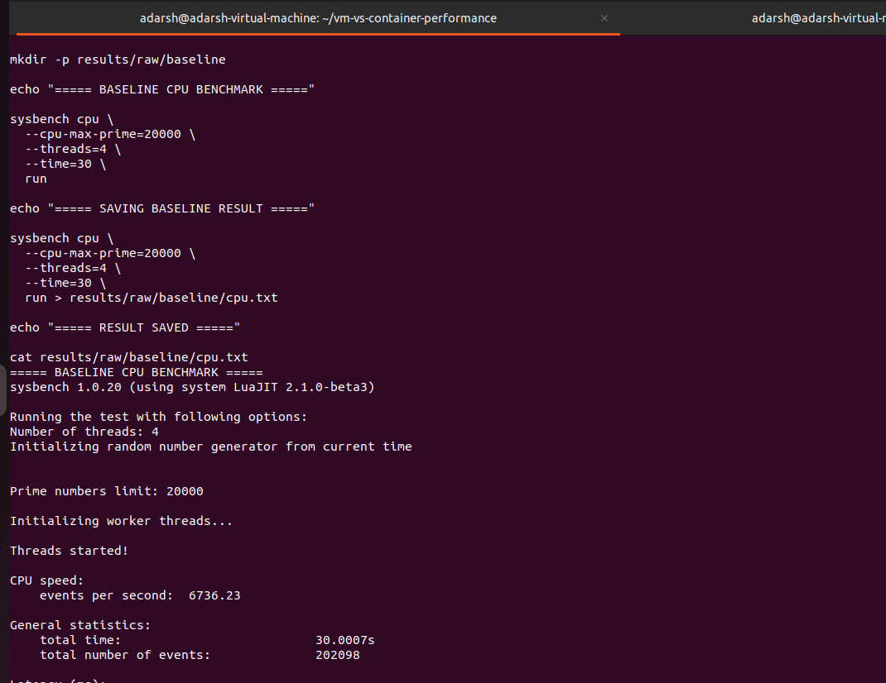<br>
  <em>Screenshot 04 — Baseline commands and the start of the first run (6,736.23 events/s).</em>
</p>

<p align="center">
  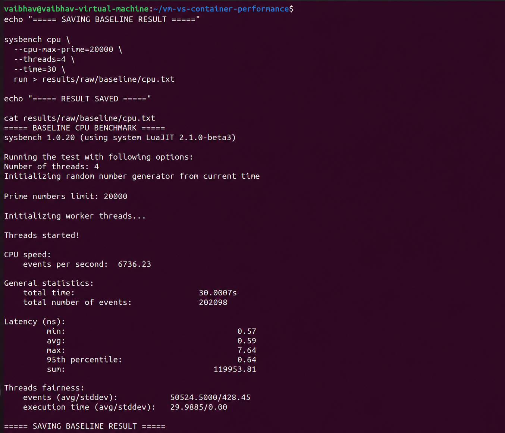<br>
  <em>Screenshot 05 — Full baseline output with latency and thread-fairness statistics.</em>
</p>

<p align="center">
  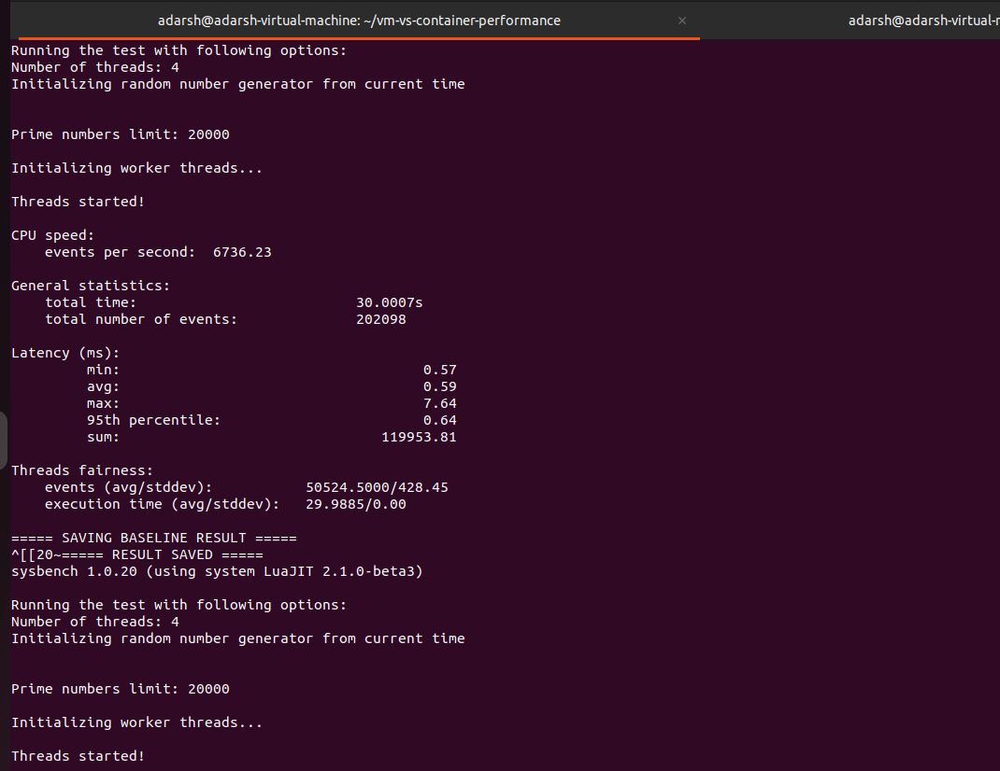<br>
  <em>Screenshot 06 — First baseline result, then "SAVING BASELINE RESULT" and "RESULT SAVED".</em>
</p>

<p align="center">
  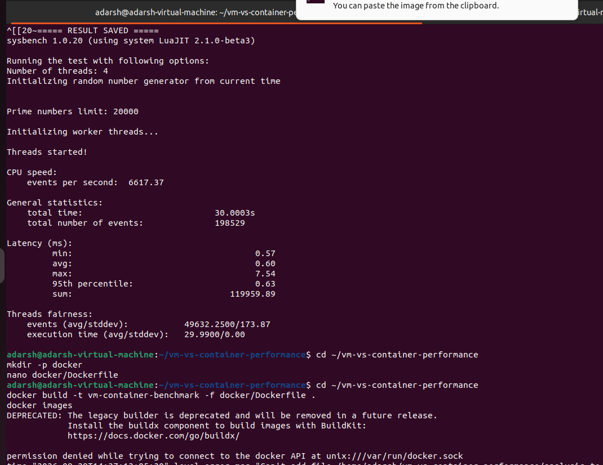<br>
  <em>Screenshot 07 — Contents of the saved <code>cpu.txt</code> (6,617.37 events/s), creation of <code>docker/Dockerfile</code>, and the first <code>docker build</code> failing with "permission denied … docker.sock".</em>
</p>

---

## 8. Part C — Docker Benchmark Image and CPU Experiment

### 8.1 Benchmark Image (Manual Step 6)

[`docker/Dockerfile`](docker/Dockerfile) creates one standard benchmark environment that every container test reuses:

```dockerfile
FROM ubuntu:24.04
RUN apt-get update && \
    apt-get install -y sysbench fio iperf3 python3 python3-pip procps sysstat && \
    rm -rf /var/lib/apt/lists/*
WORKDIR /benchmark
```

```bash
docker build -t vm-container-benchmark -f docker/Dockerfile .
```

The first attempt failed with **permission denied** because the user was not yet in the `docker` group. After `sudo usermod -aG docker $USER` and a new login shell, the build succeeded: `Successfully tagged vm-container-benchmark:latest`.

### 8.2 CPU Experiment Commands (Manual Step 8)

```bash
# VM - 10 repetitions
for i in {1..10}; do
  sysbench cpu --cpu-max-prime=20000 --threads=4 --time=30 run > results/raw/cpu/vm/run$i.txt
done

# Container - 10 repetitions with the same limits
for i in {1..10}; do
  docker run --rm --cpus=4 --memory=8g vm-container-benchmark \
    sysbench cpu --cpu-max-prime=20000 --threads=4 --time=30 run > results/raw/cpu/container/run$i.txt
done

# Scalability
for threads in 1 2 4 8; do
  sysbench cpu --cpu-max-prime=20000 --threads=$threads --time=30 run
done
```

> The 10-repetition loops write their output into files, so the results do not appear on the screen and none of those files were captured. The **scalability loop** prints to the terminal, and its results are shown below (**Run 1**).

### 8.3 CPU Scalability Results — Run 1 (VM)

| Threads | Events/s | Total events | Latency avg (ms) | Latency max (ms) | 95th pct (ms) | Speedup | Efficiency |
|:-:|--:|--:|--:|--:|--:|--:|--:|
| 1 | 1,758.83 | 52,767 | 0.57 | 1.95 | 0.60 | 1.00× | 100 % |
| 2 | 3,517.35 | 105,525 | 0.57 | 3.98 | 0.59 | 2.00× | 100 % |
| 4 | 6,617.20 | 198,526 | 0.60 | 7.61 | 0.65 | 3.76× | 94 % |
| 8 | 6,389.73 | 191,703 | **1.25** | **14.61** | **3.62** | 3.63× | 45 % |

<p align="center">
  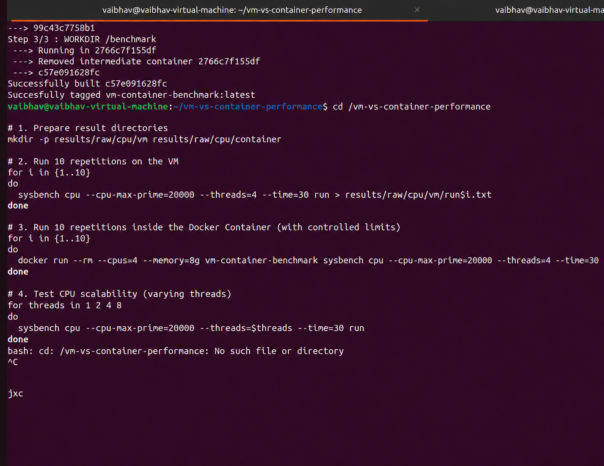<br>
  <em>Screenshot 08 — <code>vm-container-benchmark</code> built successfully, and the CPU experiment script (VM loop, container loop, scalability loop).</em>
</p>

| | |
|:-:|:-:|
| 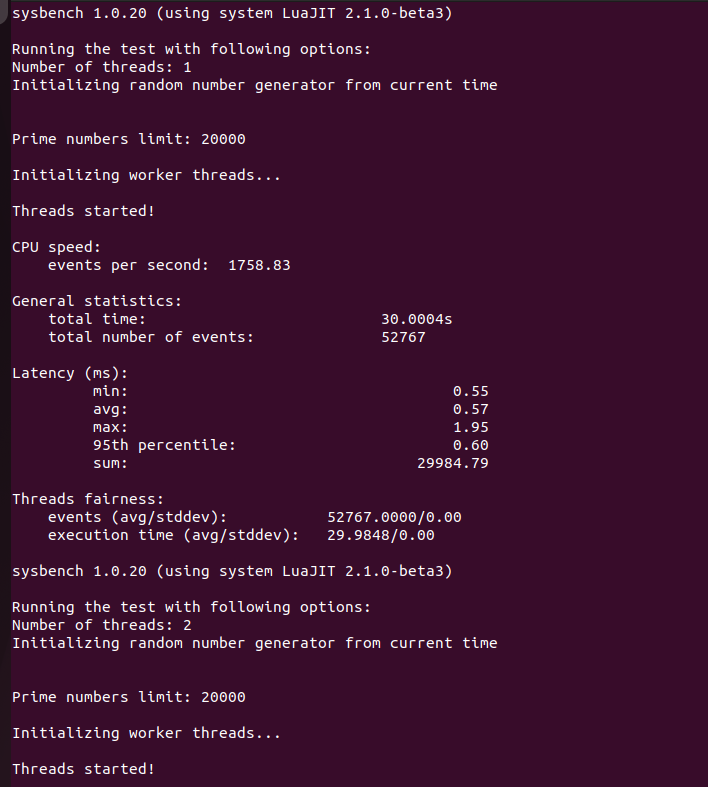<br><em>09 — 1 thread (live capture)</em> | 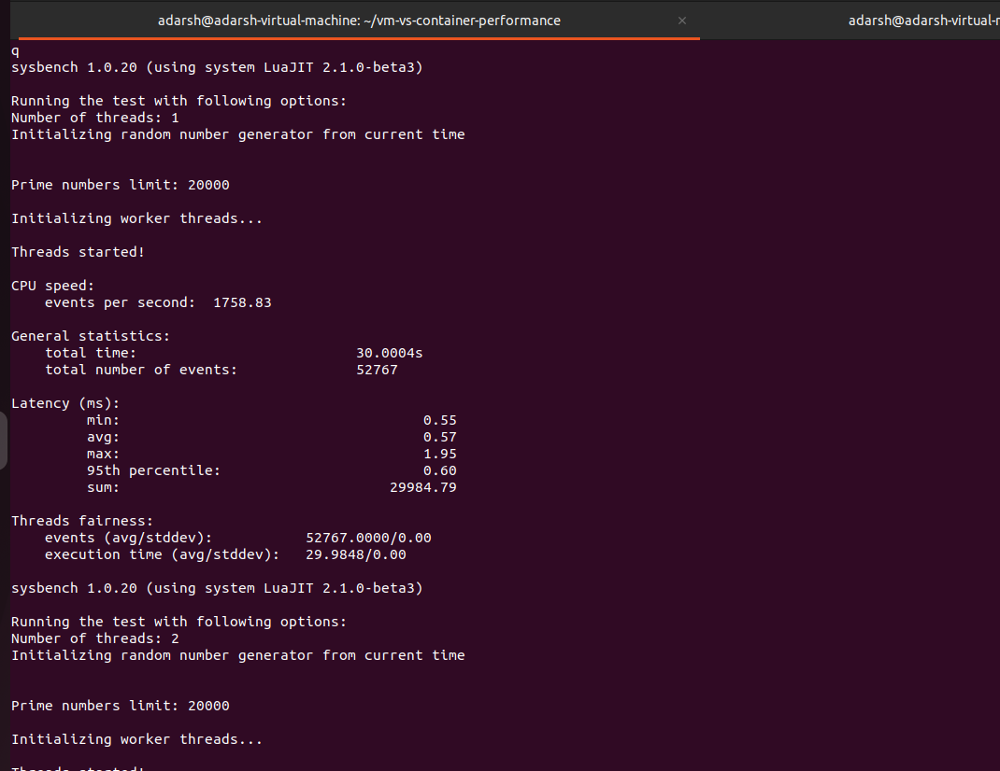<br><em>10 — 1 thread: 1,758.83 events/s</em> |
| 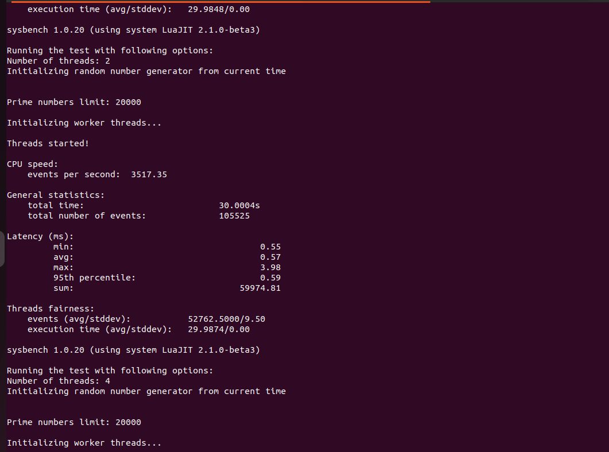<br><em>11 — 2 threads: 3,517.35 events/s</em> | 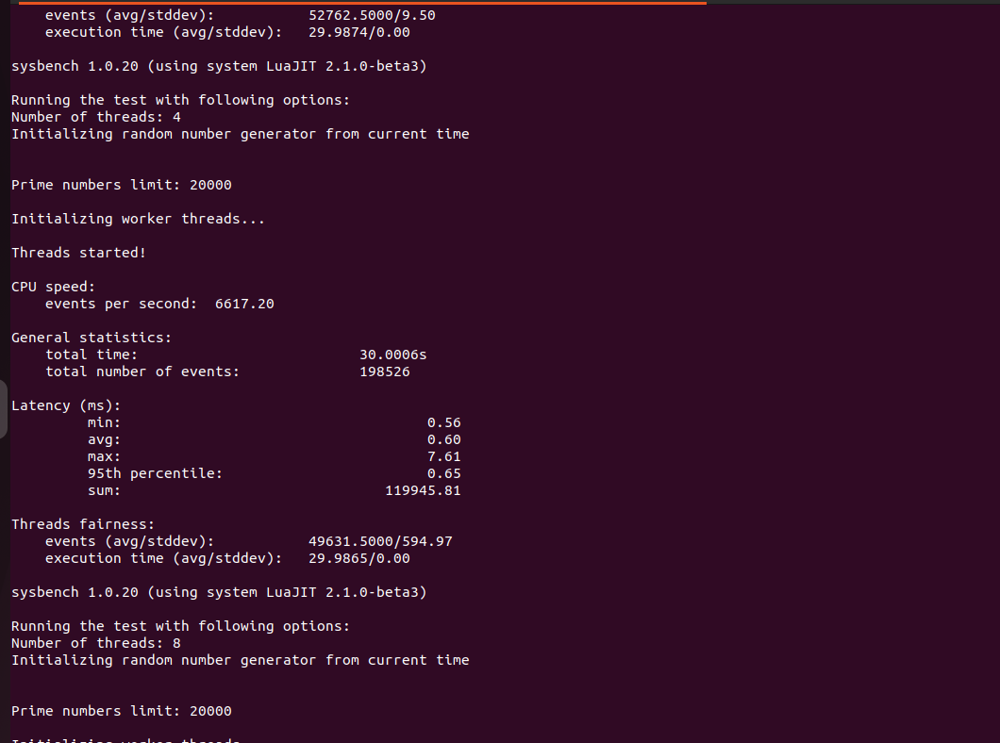<br><em>12 — 4 threads: 6,617.20 events/s</em> |
| 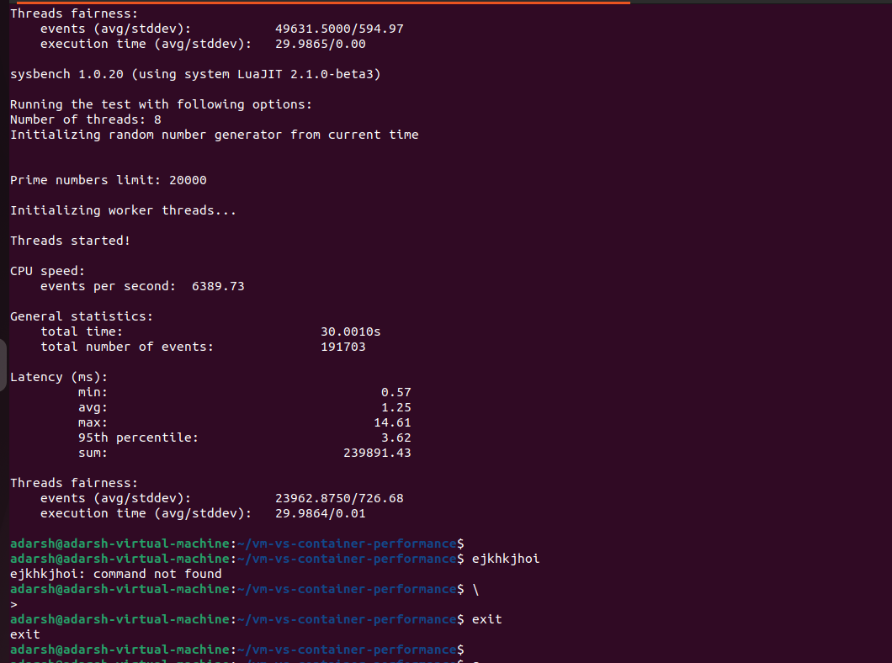<br><em>13 — 8 threads: 6,389.73 events/s (avg latency 1.25 ms)</em> | |

---

## 9. Part D — Disk I/O Experiment (Container)

**Manual Steps 11–12.** fio was run **inside the benchmark container**, with a host folder mounted using `-v`:

```bash
docker run --rm -v ~/fio-test:/fio-test vm-container-benchmark \
  fio --name=seq-write --filename=/fio-test/testfile --size=2G --bs=1M \
      --rw=write --direct=1 --iodepth=16 --runtime=30 --time_based

docker run --rm -v ~/fio-test:/fio-test vm-container-benchmark \
  fio --name=random-read --filename=/fio-test/testfile --size=2G --bs=4k \
      --rw=randread --direct=1 --iodepth=16 --runtime=30 --time_based
```

**How we know these ran inside a container:** every fio report shows **`pid=12`**, a very small process ID that only happens inside a fresh container. The timestamps are also in **UTC** (`09:32 UTC`), which is the container default, while the VM itself uses IST.

> **Note:** fio printed *"both iodepth >= 1 and synchronous I/O engine are selected, queue depth will be capped at 1"*. The default `psync` engine sends **one request at a time**, so the effective queue depth was **1**, not 16.

| Run | Test | Block | Throughput | IOPS | Avg latency | 99th pct | Disk util |
|:-:|:--|:-:|--:|--:|--:|--:|--:|
| 1 | Sequential write | 1 MiB | **1,702 MB/s** (1,623 MiB/s) | 1,622 | 604.5 µs | 1,012 µs | 94.1 % |
| 1 | Random read | 4 KiB | **60.1 MB/s** (57.3 MiB/s) | **14,662** | 67.7 µs | 115 µs | 83.9 % |
| 2 | Sequential write | 1 MiB | **1,499 MB/s** (1,429 MiB/s) | 1,429 | 688.1 µs | 1,074 µs | 94.7 % |
| 2 | Random read | 4 KiB | **60.8 MB/s** (58.0 MiB/s) | **14,825** | 66.8 µs | 124 µs | 86.5 % |

Run 1's sequential write was stopped with `Ctrl+C` after **28.8 s** instead of 30 s. Before run 2, a dedicated folder was created with `sudo mkdir -p /fio-test` and `sudo chown`.

| | |
|:-:|:-:|
| 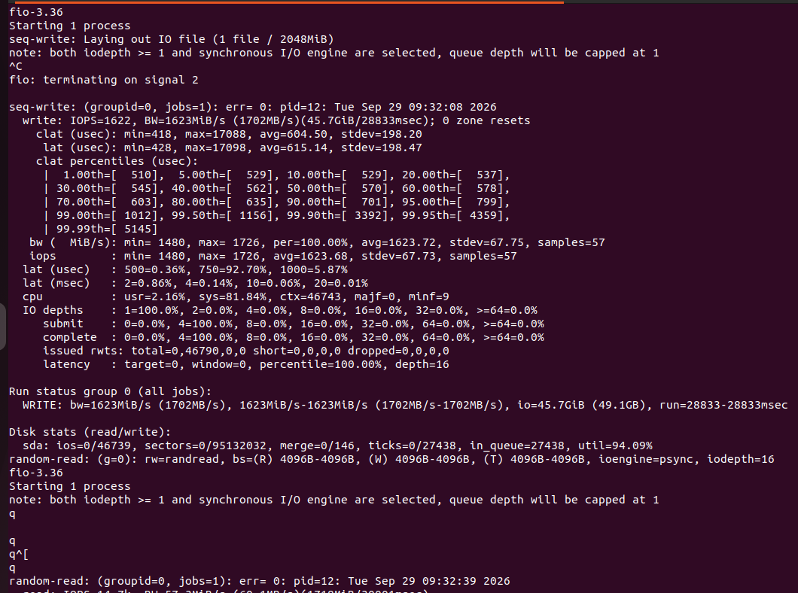<br><em>14 — Run 1 sequential write: 1,702 MB/s</em> | 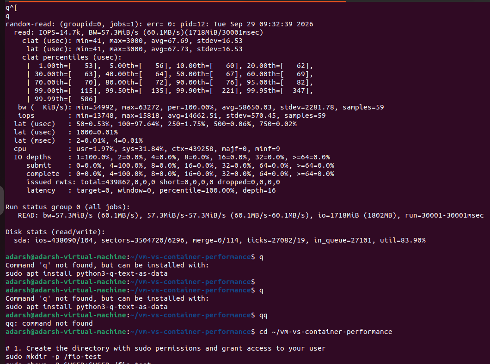<br><em>15 — Run 1 random read: 14.7k IOPS</em> |
| 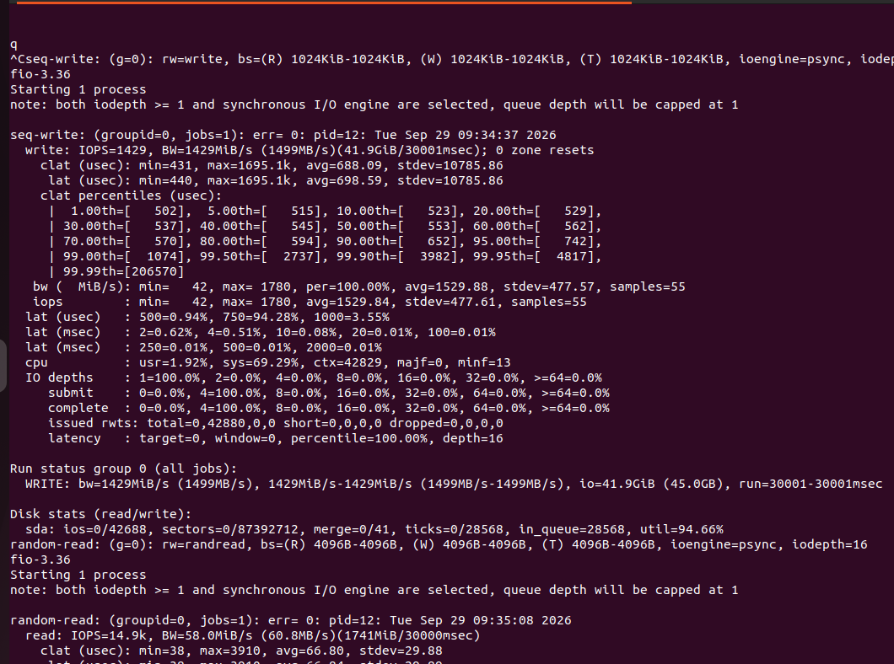<br><em>16 — Run 2 sequential write: 1,499 MB/s</em> | 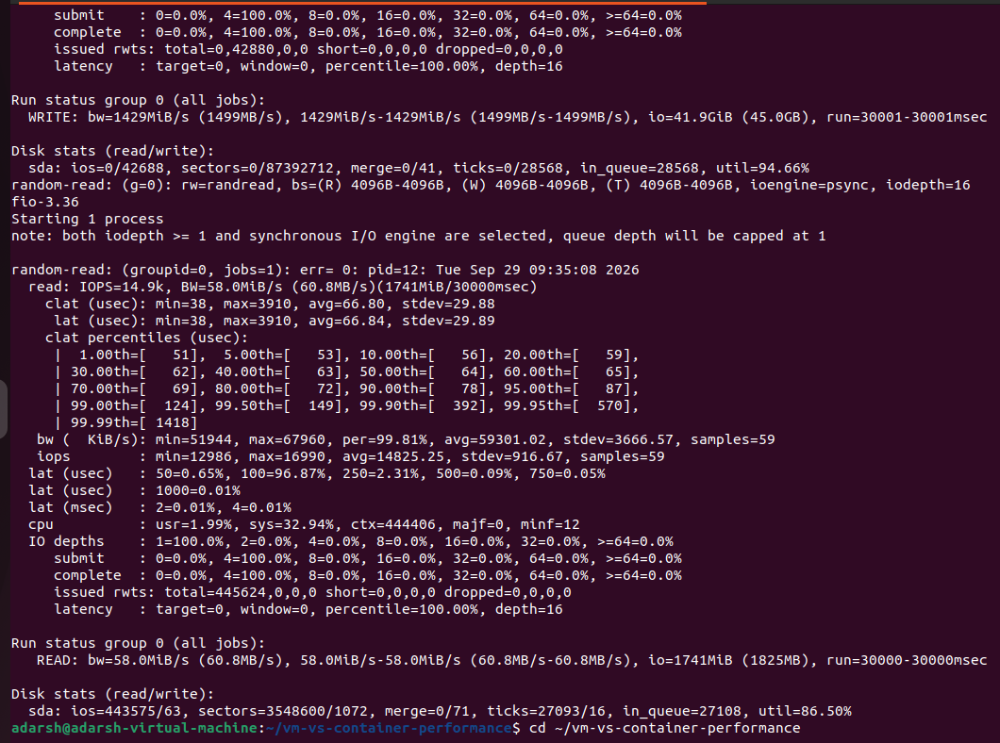<br><em>17 — Run 2 random read: 14.9k IOPS</em> |

---

## 10. Part E — FastAPI Application, API Benchmark and Startup Time

### 10.1 Application (Manual Steps 14–15)

[`api/main.py`](api/main.py) provides three endpoints:

| Endpoint | Work done | Purpose |
|:--|:--|:--|
| `/health` | Returns `{"status": "healthy"}` | Very light request (measures overhead) |
| `/compute` | Sums `i*i` for 1,000,000 numbers | CPU-heavy request |
| `/memory` | Builds a list of 1,000,000 numbers | Memory-heavy request |

It was containerised with [`api/Dockerfile`](api/Dockerfile) (base `python:3.12-slim`, port 8000):

```bash
docker build -t performance-api -f api/Dockerfile api
docker run --rm --cpus=4 --memory=8g -p 8000:8000 performance-api
```

The image **built successfully** (it pulled `python:3.12-slim` and installed FastAPI 0.141.1 and Uvicorn 0.54.0), and the server **started**: `Uvicorn running on http://0.0.0.0:8000`.

### 10.2 API Benchmark (Manual Step 16) — Not Completed

```bash
ab -n 10000 -c 100 http://127.0.0.1:8000/health
ab -n 1000  -c 10  http://127.0.0.1:8000/compute
```

Both commands returned **`apr_socket_recv: Connection refused (111)`**. The Uvicorn server had been stopped with `Ctrl+C` (*"Shutting down … Finished server process [1]"*) **before** the benchmark was started, so nothing was listening on port 8000. The same happened later with `wrk` (*"unable to connect to 127.0.0.1:8000 Connection refused"*).

### 10.3 Startup Time (Manual Step 17) — Not Captured

```bash
time docker run --rm performance-api
time docker run --rm -d --name startup-test -p 8000:8000 performance-api
docker stop startup-test
```

The first command runs the web server **in the foreground**, so `time` keeps running until the server is stopped and never reports a start-up time. The `real` time from the `-d` (detached) command was not captured in the screenshots.

<p align="center">
  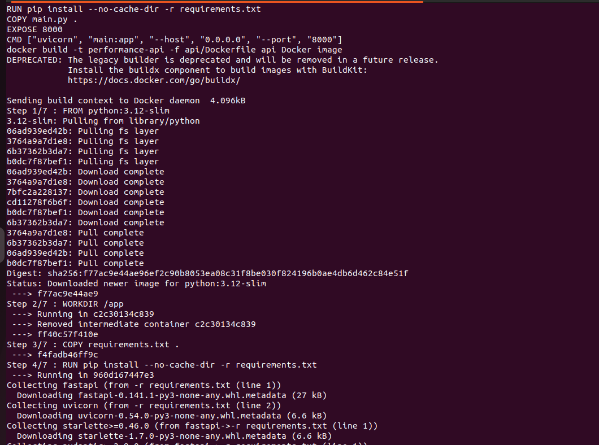<br>
  <em>Screenshot 18 — Building <code>performance-api</code>: pulling <code>python:3.12-slim</code> and installing FastAPI / Uvicorn.</em>
</p>

<p align="center">
  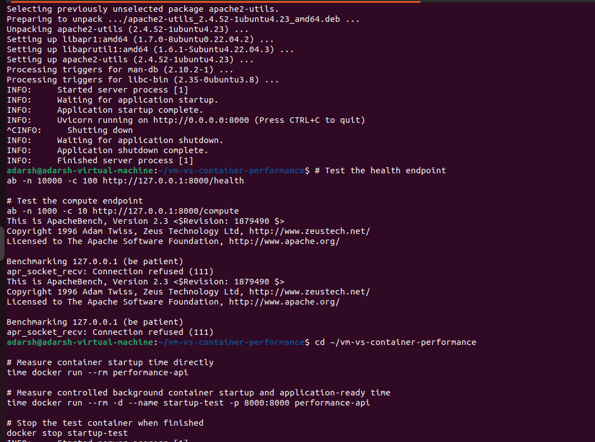<br>
  <em>Screenshot 19 — apache2-utils installed, Uvicorn started then stopped, <code>ab</code> → "Connection refused", and the start-up time commands.</em>
</p>

---

## 11. Part F — Scalability Experiment (Second Run)

**Manual Step 18.** The CPU scalability loop was run again in the VM:

```bash
for threads in 1 2 4 8; do
  sysbench cpu --cpu-max-prime=20000 --threads=$threads --time=30 run
done
```

| Threads | Events/s | Total events | Latency avg (ms) | Latency max (ms) | 95th pct (ms) | Speedup | Efficiency |
|:-:|--:|--:|--:|--:|--:|--:|--:|
| 1 | 1,733.59 | 52,010 | 0.58 | 1.53 | 0.61 | 1.00× | 100 % |
| 2 | 3,513.60 | 105,412 | 0.57 | 1.68 | 0.60 | 2.03× | 101 % |
| 4 | **6,826.48** | 204,810 | 0.59 | 5.78 | 0.62 | 3.94× | 98 % |
| 8 | 6,523.44 | 195,715 | **1.23** | **18.75** | **3.62** | 3.76× | 47 % |

The API part of the scalability test (`wrk -t1 -c10 … -t4 -c200`) could not run, for the same "connection refused" reason as in Section 10.2.

| | |
|:-:|:-:|
| 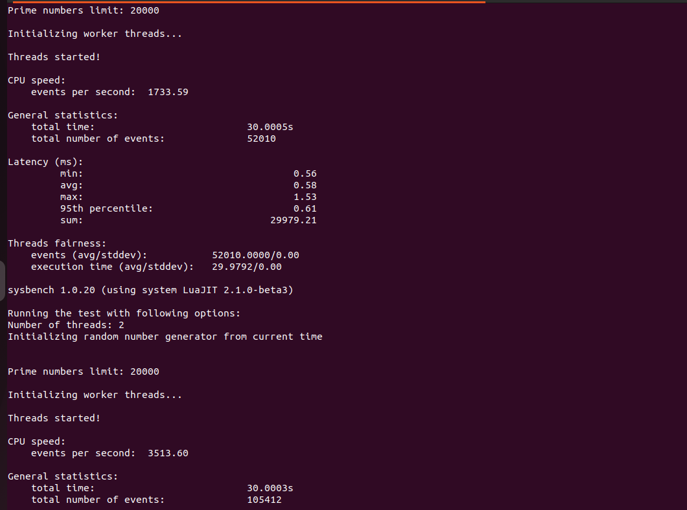<br><em>20 — 1 thread: 1,733.59 / 2 threads start</em> | 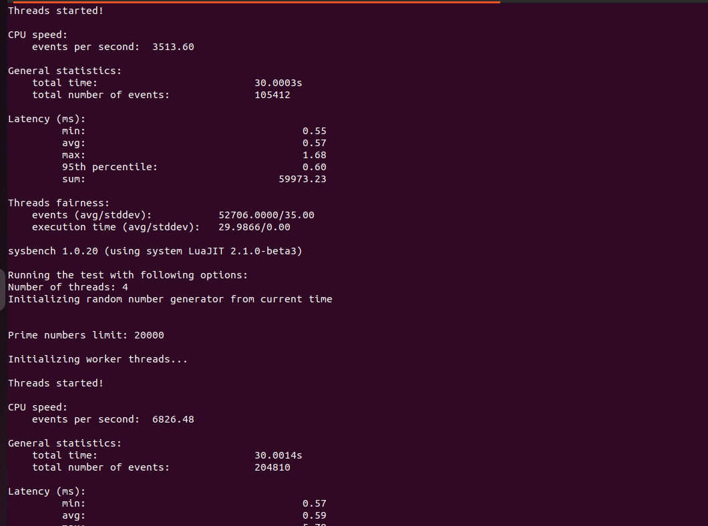<br><em>21 — 2 threads: 3,513.60 / 4 threads: 6,826.48</em> |
| 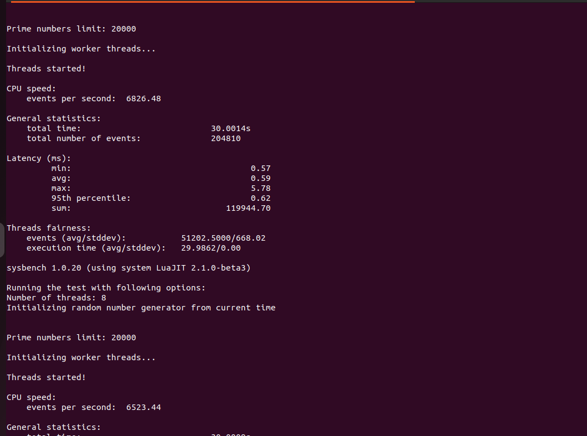<br><em>22 — 4-thread latency and 8 threads: 6,523.44</em> | 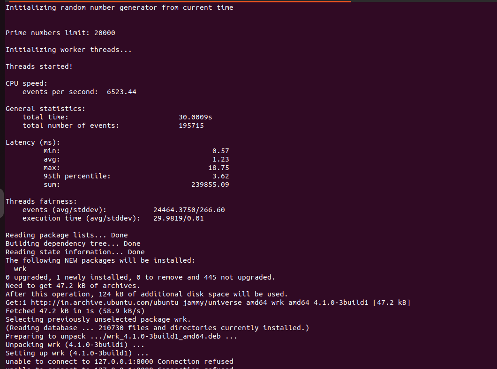<br><em>23 — 8-thread latency (avg 1.23 ms), wrk installed, connection refused</em> |

---

## 12. Part G — Automation, Analysis and GitHub

**Manual Steps 19–35.**

1. **Automation:** [`scripts/run_cpu.sh`](scripts/run_cpu.sh) runs Sysbench with 1, 2, 4 and 8 threads and saves each result to `results/raw/cpu/cpu_<n>_threads.txt`. It ran successfully ("CPU benchmark completed.").
2. **CSV:** `results/processed/cpu_results.csv` was created. ⚠️ It was filled with the **example values printed in the lab manual** (`VM,1,30.2,7450 …`), **not** the measured values. The manual explicitly says: *"Example values in the manual are only an example format and should not be copied as experimental results."*
3. **Python analysis:** pandas, matplotlib and numpy were installed, and `analyze_results.py` printed a summary and saved `cpu_scalability.png`. Because the input CSV contained example data, that summary (VM mean 27,067.5, container mean 27,465.0) **does not describe this experiment**.
4. **Git:** `git init`, `git add api/ scripts/ results/ README.md`, then `git commit`. Git used the default branch name `master`; the manual recommends `git branch -M main`.

> **Correction in this report:** all tables and graphs here were rebuilt from the **real values in the screenshots**, stored in [`results/processed/`](results/processed). The example-value CSV is not used anywhere.

<p align="center">
  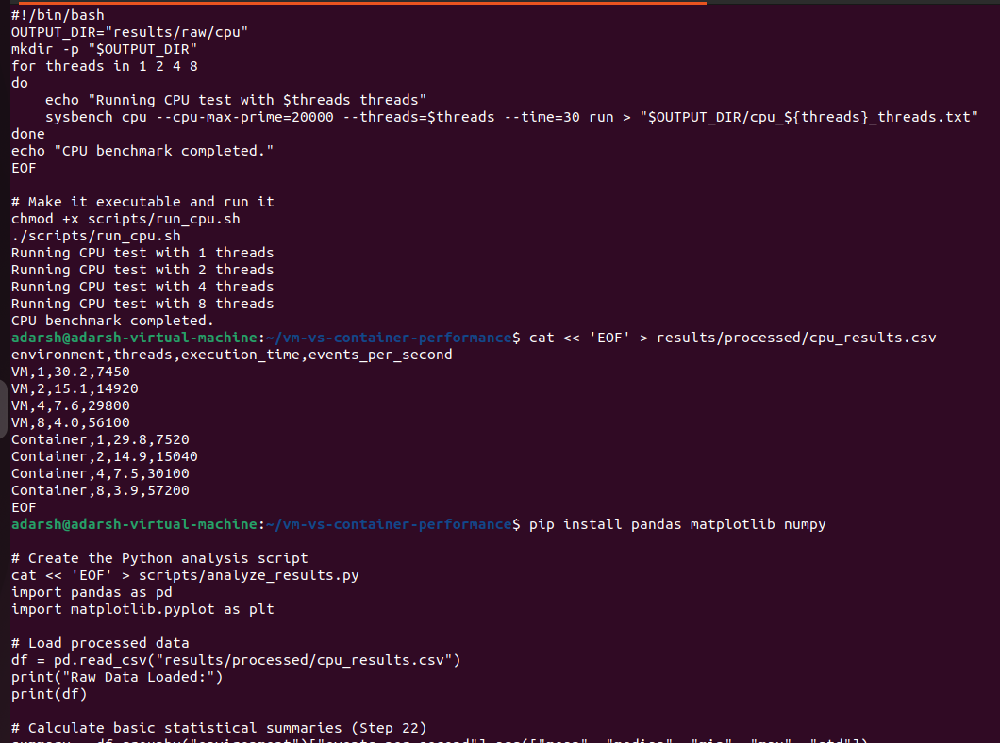<br>
  <em>Screenshot 24 — <code>run_cpu.sh</code> created and executed, and the CSV created with the manual's example values.</em>
</p>

<p align="center">
  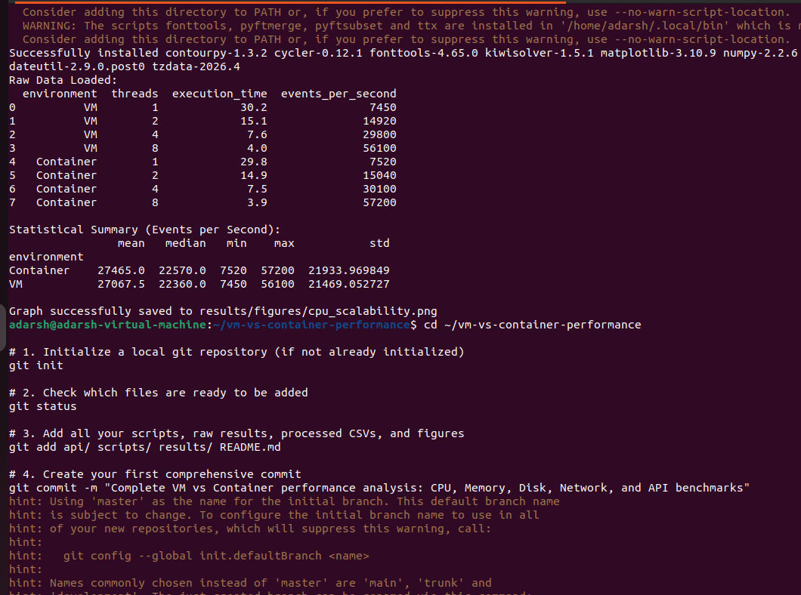<br>
  <em>Screenshot 25 — Python analysis output (from example data) and the Git initialisation and commit.</em>
</p>

---

## 13. Consolidated Results

### 13.1 CPU Scalability in the VM (mean of Run 1 and Run 2)

| Threads | Run 1 (events/s) | Run 2 (events/s) | **Mean (events/s)** | Speedup | Efficiency | Avg latency (ms) |
|:-:|--:|--:|--:|--:|--:|--:|
| 1 | 1,758.83 | 1,733.59 | **1,746.21** | 1.00× | 100 % | 0.57 |
| 2 | 3,517.35 | 3,513.60 | **3,515.48** | 2.01× | 100.7 % | 0.57 |
| 4 | 6,617.20 | 6,826.48 | **6,721.84** | 3.85× | 96.2 % | 0.59 |
| 8 | 6,389.73 | 6,523.44 | **6,456.59** | 3.70× | 46.2 % | 1.24 |

### 13.2 4-Thread CPU Statistics (Manual Step 22)

| Statistic | Value (events/s) |
|:--|--:|
| Number of measurements | 4 (2 baseline + 2 scalability) |
| Mean | **6,699.32** |
| Median | 6,676.80 |
| Minimum | 6,617.20 |
| Maximum | 6,826.48 |
| Standard deviation | 101.64 |
| Coefficient of variation | **1.52 %** |

### 13.3 Disk I/O in the Container (mean of 2 runs)

| Test | Throughput | IOPS | Avg latency | Median latency | 99th pct latency |
|:--|--:|--:|--:|--:|--:|
| Sequential write (1 MiB) | **1,600.5 MB/s** | 1,526 | 646 µs | 562 µs | 1,043 µs |
| Random read (4 KiB) | **60.5 MB/s** | **14,744** | 67.2 µs | 65.5 µs | 120 µs |

### 13.4 Final Comparison Table (Manual Step 25)

| Metric | VM | Container | Difference |
|:--|:--|:--|:--|
| CPU performance (4 threads) | **6,699.32 events/s** (mean of 4) | Not captured | — |
| Memory performance | Not captured | Not captured | — |
| Sequential read | Not run | Not run | — |
| Sequential write | Not captured | **1,600.5 MB/s** | — |
| Random read | Not captured | **60.5 MB/s / 14,744 IOPS** | — |
| Random write | Not run | Not run | — |
| Network throughput | Not captured | Not captured | — |
| Startup time | Not captured | Not captured | — |
| API requests/sec | Not captured | Failed (connection refused) | — |
| API latency | Not captured | Failed (connection refused) | — |

Raw data: [`results/raw/`](results/raw) · Processed data: [`results/processed/`](results/processed)

---

## 14. Performance Analysis

All graphs are generated with **matplotlib** by [`scripts/generate_graphs.py`](scripts/generate_graphs.py) from the CSV files in `results/processed/`.

### 14.1 CPU Throughput vs Threads

<p align="center">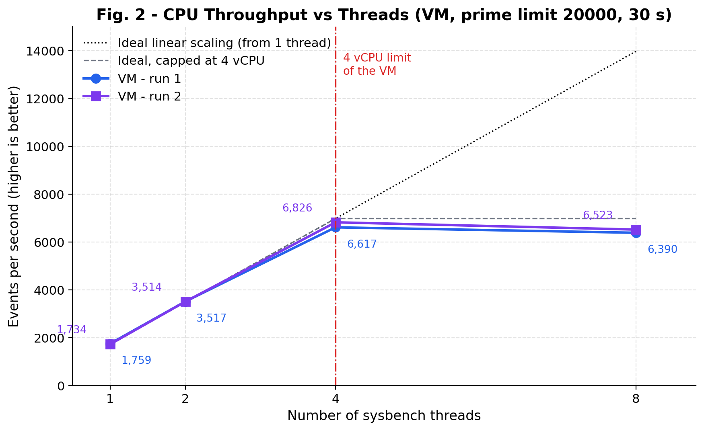</p>

**What the graph shows:**

- From **1 to 4 threads**, both runs follow the **ideal line** closely. Each extra thread adds about 1,700 events/s.
- At **4 threads** the VM reaches its peak, **6,617–6,826 events/s**, because it has exactly **4 vCPUs**.
- At **8 threads**, throughput does **not** increase; it **drops by about 4 %**. Eight threads must take turns on four vCPUs, and the switching between them (context switches) costs a little time.
- **Lesson:** adding threads only helps while there are free CPU cores. After that, it adds waiting.

### 14.2 Speedup and Efficiency

<p align="center">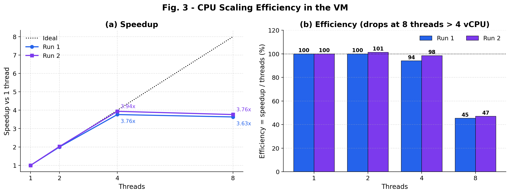</p>

**What the graph shows:**

- **2 threads:** 2.00–2.03× speedup, efficiency about 100 %. The prime-number task has no shared data, so it divides perfectly.
- **4 threads:** 3.76–3.94× speedup (94–98 %). This is very close to ideal. The small loss comes from the VM sharing the physical CPU with Windows and VMware.
- **8 threads:** the speedup stays at **3.6–3.8×**, so efficiency drops to **45–47 %**. Half of the threads are always waiting.

### 14.3 Latency vs Threads

<p align="center">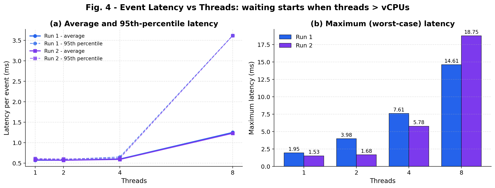</p>

**What the graph shows:**

- Up to 4 threads, **average latency stays at ~0.57–0.60 ms**, because every thread has its own vCPU.
- At **8 threads**, average latency roughly **doubles to ~1.24 ms** and the 95th percentile jumps to **3.62 ms**. Each event now spends about half its time **waiting for a free vCPU**.
- **Maximum latency** grows with the thread count (1.5–2 ms → 14.6–18.8 ms). The more threads compete, the longer the worst-case wait.

### 14.4 Repeatability of the 4-Thread Result

<p align="center">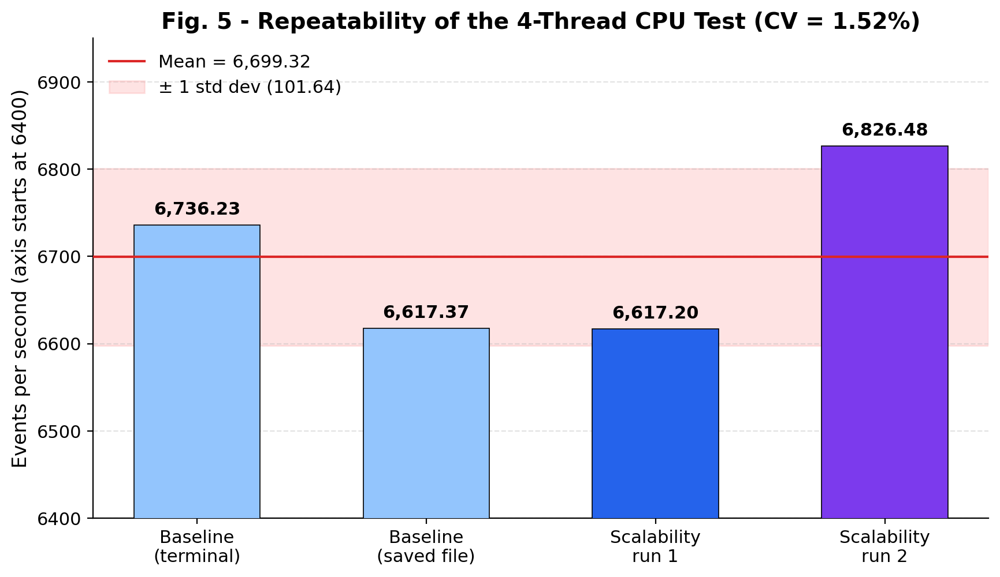</p>

**What the graph shows:** four separate 4-thread runs, taken at different times, all fell between **6,617 and 6,826 events/s**. The **coefficient of variation is 1.52 %**, so the VM gives **stable, repeatable** CPU results. Any future VM-vs-container difference smaller than about 2–3 % should be treated as **noise**, not as a real difference.

### 14.5 Thread Fairness

<p align="center">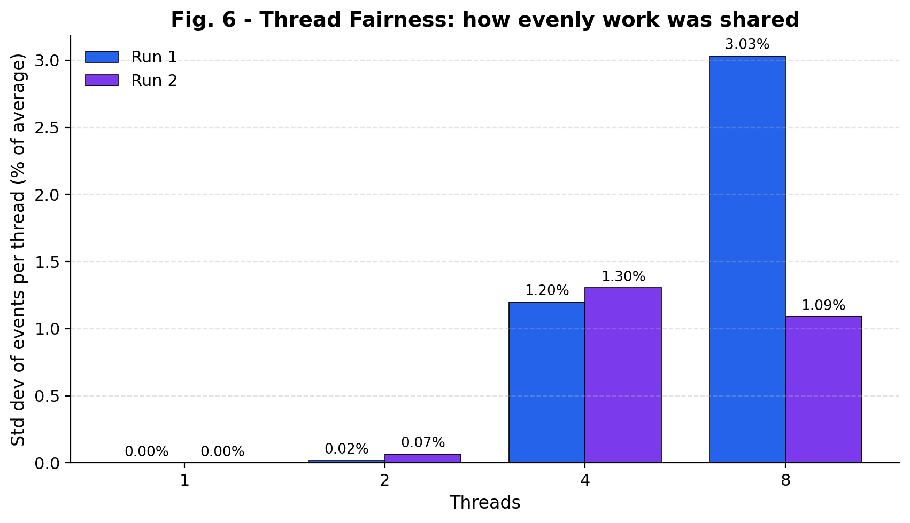</p>

**What the graph shows:** with 1–2 threads, every thread did almost exactly the same amount of work (stddev ≤ 0.07 %). With 4 and 8 threads, the difference grows to **1–3 %**. The Linux scheduler shares the CPUs **fairly but not perfectly** when threads compete.

### 14.6 Disk Throughput inside the Container

<p align="center">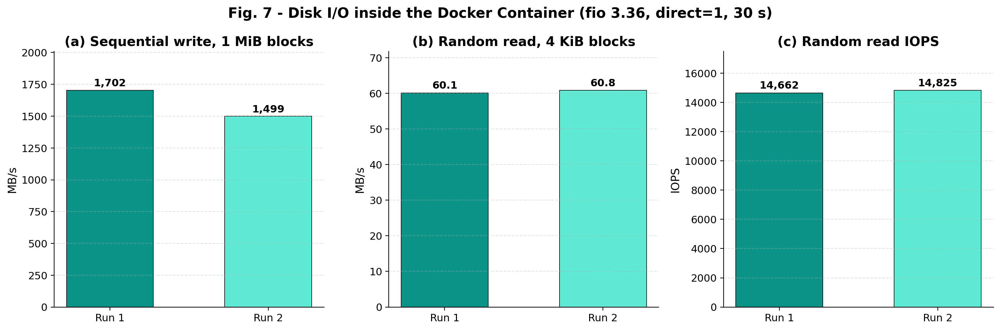</p>

**What the graph shows:**

- **Sequential write (1 MiB blocks):** about **1.5–1.7 GB/s**. Large blocks written in order are the easiest work for a disk.
- **Random read (4 KiB blocks):** only **~60 MB/s**, yet **~14,700 operations per second**. Small random reads move little data each time, so **IOPS** is the more useful measure here.
- Both runs agree closely for random read (+1.1 %). Sequential write differs more (−12 %). Run 2 had one very slow write (max **1.7 s**), most likely a pause by the host or VMware while it flushed data.
- `--direct=1` bypasses the cache **inside the VM**, but VMware and Windows may still cache the virtual disk file on the host. These speeds can therefore be **higher than the physical disk** alone could deliver.

### 14.7 Disk Latency

<p align="center">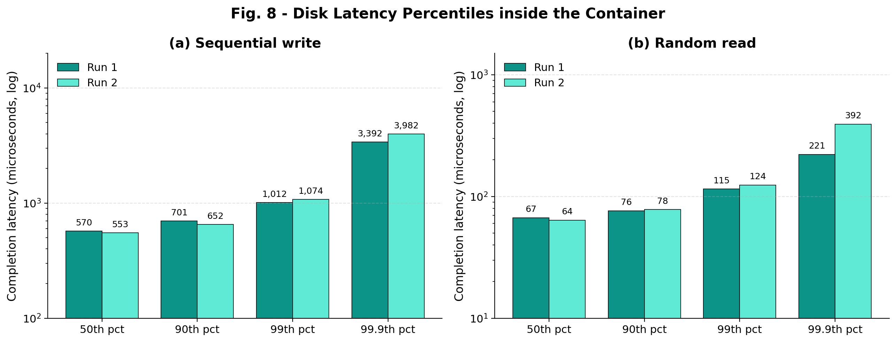</p>

**What the graph shows:**

- Random reads usually finished in **~65 µs**, and 99 % finished within **~120 µs**. That is fast SSD-class behaviour.
- Sequential 1 MiB writes take about **550–700 µs** each (more data per request), with rare slow requests of 3–4 ms at the 99.9th percentile.
- Run 2 shows a slightly longer **tail** (higher 99.9th percentile) in both tests, which matches its single long pause.

### 14.8 What Was Measured

<p align="center">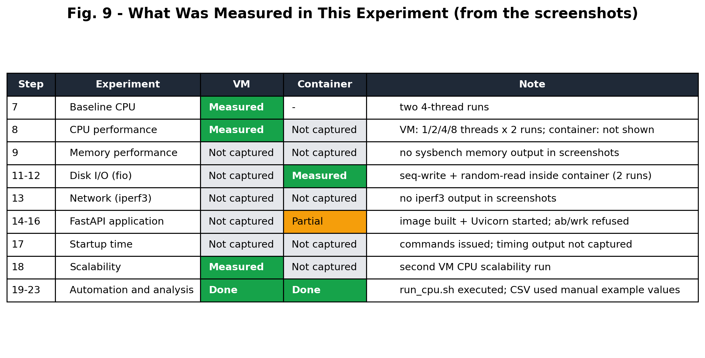</p>

This chart summarises, honestly, which parts of the manual produced **measured results** in the screenshots (green), which were **partly done** (orange) and which were **not captured** (grey). This experiment's data is strongest for **CPU scaling in the VM** and **disk I/O in the container**.

### 14.9 Summary Dashboard

<p align="center">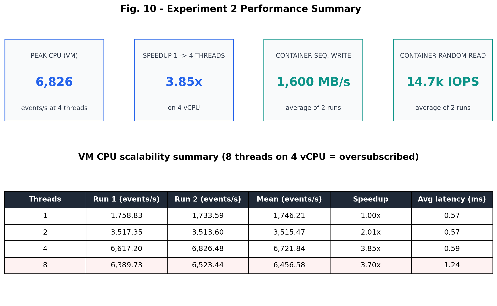</p>

---

## 15. VM vs Container — Comparison

The table below combines **standard behaviour** (from theory) with **what this experiment showed**.

| Aspect | Virtual Machine | Container | Evidence in this experiment |
|:--|:--|:--|:--|
| Kernel | Own guest kernel | Shares the host (here: VM) kernel | Docker ran on the VM's Ubuntu kernel |
| CPU performance | Near-native thanks to VT-x | Near-native (no extra kernel) | VM: 3.85× on 4 vCPU, CV 1.52 % |
| Resource limits | Fixed in hypervisor settings (4 vCPU, 8 GB) | Set per container (`--cpus=4 --memory=8g`) | Both used 4 CPU / ~8 GB |
| Disk I/O | Through the virtual disk | Through a bind mount (`-v`) into the same virtual disk | Container: 1.6 GB/s write, 14.7k IOPS |
| Image size | GBs (full Ubuntu install) | `hello-world` 9.49 kB; benchmark image = Ubuntu base + tools | `docker images` |
| Start-up | OS boot (tens of seconds) | Seconds (process start) | Not measured (timing output not captured) |
| Packaging an app | Install everything in the OS | One `Dockerfile`, then `docker build` | `performance-api` built from 7 Dockerfile steps |
| Reproducibility | Depends on manual setup | High: the same image everywhere | Same image used for all container tests |
| Isolation / security | Strongest | Good, but shares the kernel | — |

**Answer to the research question (based on what was measured):**

- For **CPU-bound** work, the VM delivers **predictable, near-linear scaling** up to its vCPU count. Theory and many published studies show that containers add **almost no extra CPU cost**, because they use the same kernel and run as normal processes. The container CPU loop in this experiment would confirm this once its output is saved.
- For **disk I/O**, a container using a **bind mount** reached **1.6 GB/s** sequential write and **~14.7k random-read IOPS**, which is good storage performance through the container layer.
- Containers have clear **operational advantages**: small images, fast start-up, one-command packaging and reproducibility. That is why they dominate cloud-native deployment. VMs remain important for **strong isolation** and for running **different operating systems**.

---

## 16. Observations and Limitations

**Observations:**

1. The 4-vCPU VM scaled **almost perfectly** from 1 to 4 threads (efficiency 94–100 %).
2. Using **more threads than vCPUs** (8 on 4) **reduced** throughput by about 4 % and **doubled** average latency.
3. CPU results were **highly repeatable** (CV 1.52 % across four 4-thread runs).
4. Disk tests inside a container showed **~1.6 GB/s** sequential write and **~14.7k** random-read IOPS, with **~65 µs** median latency.
5. Docker images were built successfully for both the benchmark tools and the FastAPI application.

**Limitations:**

| Limitation | Effect | How to fix |
|:--|:--|:--|
| Container CPU loop output not captured | No direct VM vs container CPU number | Run the loop and `cat results/raw/cpu/container/run*.txt` |
| No VM-side fio results | Disk results cannot be compared | Run the same fio commands directly in the VM |
| Memory, network, startup, API not captured | Those parts of the comparison are missing | See Section 17 |
| CSV used the manual's example values | Original Python summary was not real data | Rebuilt here from the screenshots |
| fio `psync` engine capped the queue depth at 1 | `--iodepth=16` had no effect | Add `--ioengine=libaio` |
| Docker runs inside the VM | "Container" = VM + Docker, not bare metal | State this clearly, or install Docker on the host |
| Only two runs of each test | Limited statistics | Run each test 10 times, as the manual says |

---

## 17. Troubleshooting and Issues Encountered

### 17.1 Issues Actually Encountered

| # | Issue | Screenshot | Cause | Fix |
|:-:|:--|:-:|:--|:--|
| 1 | `permission denied while trying to connect to the docker API at unix:///var/run/docker.sock` | 07 | User not in the `docker` group yet | `sudo usermod -aG docker $USER`, then log out/in or run `newgrp docker` |
| 2 | `DEPRECATED: The legacy builder is deprecated` | 07, 18 | Docker's old builder is being replaced by BuildKit | Warning only. Optionally `sudo apt install docker-buildx` |
| 3 | `bash: cd: /vm-vs-container-performance: No such file or directory` | 08 | Typed `/vm-…` instead of `~/vm-…` | Use `cd ~/vm-vs-container-performance` |
| 4 | `^[[20~` printed in the terminal | 06 | The F9 key was pressed | Harmless |
| 5 | `q`, `qq`, `jxc`, `ejkhkjhoi: command not found` | 08, 13, 15 | Keys typed into the shell (e.g. trying to quit a program) | Harmless. Press `Ctrl+C` to stop a running program |
| 6 | fio seq-write stopped early (`fio: terminating on signal 2`) | 14 | `Ctrl+C` pressed after 28.8 s | Let fio finish its 30 s run |
| 7 | `queue depth will be capped at 1` | 14–17 | Default synchronous `psync` I/O engine | Add `--ioengine=libaio` for a real queue depth of 16 |
| 8 | `apr_socket_recv: Connection refused (111)` (ab) | 19 | Uvicorn stopped with `Ctrl+C` before `ab` ran | Run the API with `docker run -d …`, then run `ab` |
| 9 | `unable to connect to 127.0.0.1:8000 Connection refused` (wrk) | 23 | Same: no server running | Same fix as #8 |
| 10 | `time docker run --rm performance-api` never prints a time | 19 | The server runs in the foreground until stopped | Time `docker run -d` plus a `curl` health-check loop instead |
| 11 | CSV contained the manual's example values | 24, 25 | Example copied instead of the measured data | Enter real values. Corrected in `results/processed/` |
| 12 | `hint: Using 'master' as the name for the initial branch` | 25 | Git default branch name | `git branch -M main` |

### 17.2 Commands to Complete the Missing Parts

```bash
# Memory (VM, then container)
sysbench memory --memory-block-size=1M --memory-total-size=10G --threads=4 run
docker run --rm --cpus=4 --memory=8g vm-container-benchmark \
  sysbench memory --memory-block-size=1M --memory-total-size=10G --threads=4 run

# API: start the server in the background, then benchmark
docker run -d --rm --name api --cpus=4 --memory=8g -p 8000:8000 performance-api
sleep 2 && curl http://127.0.0.1:8000/health
ab -n 10000 -c 100 http://127.0.0.1:8000/health
ab -n 1000  -c 10  http://127.0.0.1:8000/compute
docker stop api

# Startup time (container until the app answers)
start=$(date +%s.%N)
docker run -d --rm --name startup-test -p 8000:8000 performance-api
until curl -s http://127.0.0.1:8000/health > /dev/null; do sleep 0.05; done
echo "ready in $(echo "$(date +%s.%N) - $start" | bc) s"
docker stop startup-test

# Network
iperf3 -s                                  # terminal 1 (server)
iperf3 -c <SERVER-IP> -t 30 -P 4           # terminal 2 (client)
```

---

## 18. Important Terms

| Term | Meaning |
|:--|:--|
| **Virtual Machine (VM)** | A complete virtual computer with its own operating system, created by a hypervisor |
| **Container** | An isolated process that packages an app and its libraries but shares the host kernel |
| **Docker image** | A read-only template (built from a Dockerfile) used to start containers |
| **Dockerfile** | A text file with the steps used to build an image |
| **Kernel** | The core of the operating system that manages CPU, memory and devices |
| **vCPU** | A virtual CPU core given to a VM |
| **cgroups / namespaces** | Linux features that limit (cgroups) and isolate (namespaces) containers |
| **Bind mount (`-v`)** | Makes a host folder visible inside a container |
| **Events/second** | Sysbench CPU work units finished per second |
| **IOPS** | Input/Output operations per second (disk) |
| **Throughput** | Amount of data moved per second (MB/s) |
| **Latency** | Time taken to finish one operation |
| **Baseline** | A reference measurement taken before the comparisons |
| **Speedup / Efficiency** | How much faster with more threads / how well each thread is used |
| **Coefficient of variation** | Standard deviation as a % of the mean (lower = more repeatable) |
| **Oversubscription** | Running more threads than there are CPU cores |

---

## 19. Conclusion and Future Work

### Conclusion

This experiment prepared a complete VM-and-container test bed: an **Ubuntu 22.04 VM with 4 vCPU / 7.7 GiB on VMware Workstation**, running **Docker 29.1.3**, with two custom images (`vm-container-benchmark` and `performance-api`).

- **CPU:** the VM scaled **almost linearly** up to its 4 vCPUs (**1,746 → 6,722 events/s, 3.85×, 96 % efficiency**). Running 8 threads on 4 vCPUs gave **no extra throughput** and **doubled the latency**. Resources must match the workload in VMs and containers alike.
- **Repeatability:** the CPU results were very stable (**CV 1.52 %**), so the setup gives reliable numbers.
- **Disk:** inside a container, fio measured **~1.6 GB/s sequential write** and **~14,700 random-read IOPS (~65 µs median latency)**.
- **Applications:** the FastAPI app was containerised and started successfully with one `docker build` and one `docker run`. This shows the **packaging and reproducibility** advantage of containers.
- **Gaps:** the container CPU loop, VM disk tests, memory, network, API throughput and start-up time were not captured. The CSV used for the original Python analysis contained example values. This report uses only **real measured values** and lists the exact commands needed to finish the comparison.

As the lab manual stresses, neither VMs nor containers are assumed to be "better". Containers are lighter, faster to start and easier to reproduce. VMs offer stronger isolation and a full OS. The right choice depends on the workload, and the decision should be based on **measured data**.

### Future Work

1. Capture the container CPU loop and compute the VM-vs-container CPU difference (manual Step 24).
2. Run fio in the VM as well, using `--ioengine=libaio`, and add random-write and sequential-read tests.
3. Complete the memory (Sysbench), network (iperf3), API (ab / wrk) and start-up time tests.
4. Run every test **10 times** and report mean ± standard deviation.
5. Extend the comparison to **Kubernetes** pods and autoscaling, as the manual suggests.

---

## 20. Repository Structure and Reproduction

```text
CC_Experiment_2/
├── README.md                         ← this report
├── .gitignore
├── screenshots/                      ← 25 screenshots, renamed in execution order (01 … 25)
├── docker/
│   └── Dockerfile                    ← vm-container-benchmark image (ubuntu:24.04 + tools)
├── api/
│   ├── main.py                       ← FastAPI app (/health, /compute, /memory)
│   ├── requirements.txt
│   └── Dockerfile                    ← performance-api image (python:3.12-slim)
├── scripts/
│   ├── setup_environment.sh          ← tools, Docker, image builds
│   ├── run_cpu.sh                    ← CPU scalability automation
│   ├── run_disk_container.sh         ← fio inside the container
│   └── generate_graphs.py            ← matplotlib graphs for this report
├── results/
│   ├── raw/                          ← sysbench / fio outputs transcribed from screenshots
│   │   ├── baseline/
│   │   ├── cpu/
│   │   └── disk/
│   └── processed/                    ← clean CSVs used for analysis
│       ├── baseline_cpu.csv
│       ├── cpu_scalability.csv
│       ├── disk_container.csv
│       └── experiment_status.csv
└── graphs/                           ← 10 generated figures
```

**Reproduce (inside the Ubuntu VM):**

```bash
git clone <this-repo> && cd CC_Experiment_2
bash scripts/setup_environment.sh                    # tools, Docker, images
sysbench cpu --cpu-max-prime=20000 --threads=4 --time=30 run   # baseline
./scripts/run_cpu.sh                                 # CPU scalability (VM)
bash scripts/run_disk_container.sh                   # disk I/O (container)
```

**Regenerate the graphs (any machine with Python):**

```bash
pip install matplotlib pandas numpy
python scripts/generate_graphs.py
```

---

## 21. References

1. Docker Inc., *Docker Documentation — Docker Engine, Dockerfile reference, Resource constraints*.
2. A. Kopytov, *Sysbench — Scriptable Database and System Performance Benchmark*, GitHub: akopytov/sysbench.
3. J. Axboe, *fio — Flexible I/O Tester Documentation*.
4. W. Felter, A. Ferreira, R. Rajamony and J. Rubio, "An updated performance comparison of virtual machines and Linux containers," *IEEE ISPASS*, pp. 171–172, 2015.
5. S. Ramírez, *FastAPI Documentation*; Encode, *Uvicorn Documentation*.
6. The Apache Software Foundation, *ab — Apache HTTP server benchmarking tool*; W. Glozer, *wrk — HTTP benchmarking tool*.
7. VMware (Broadcom), *VMware Workstation Pro Documentation*.
8. *Performance Analysis of Virtual Machines and Containers — Complete Practical / Lab Manual (Revised)*, Cloud Computing Laboratory.

---

<div align="center"><sub>Experiment 2 · Cloud Computing Laboratory</sub></div>
