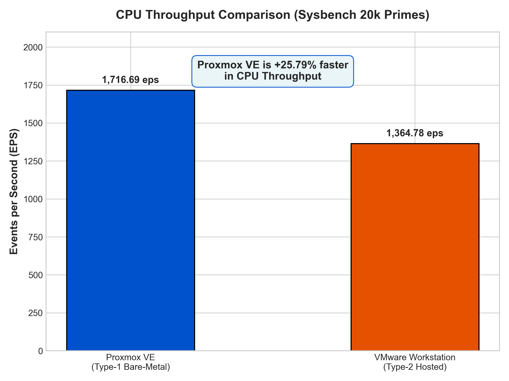
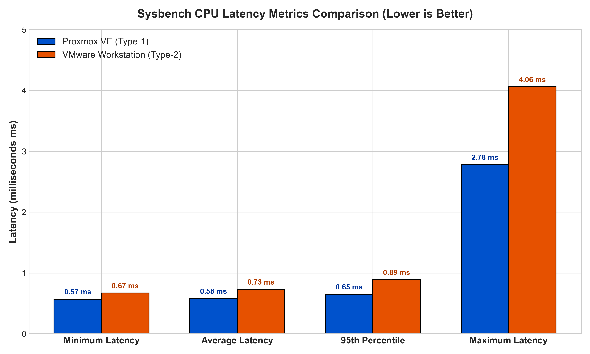

# LABORATORY REPORT
## Performance Analysis of Type-1 and Type-2 Hypervisors

**Course Title:** Cloud Computing / Computer Networks Laboratory  
**Experiment No:** 1  
**Topic:** Comparative CPU Performance Evaluation of Proxmox VE (Type-1) and VMware Workstation (Type-2) Hypervisors  

---

## 1. Objective of the Experiment

The objective of this laboratory experiment is to:
1. Deploy two identically configured Ubuntu Virtual Machines on two distinct hypervisor architectures:
   - **Type-1 Hypervisor**: Proxmox VE (Bare-metal)
   - **Type-2 Hypervisor**: VMware Workstation Pro (Hosted)
2. Execute a CPU computational benchmark using `sysbench` (`--cpu-max-prime=20000`).
3. Collect performance parameters including total execution time, total events, events per second (throughput), minimum latency, average latency, maximum latency, and 95th percentile latency.
4. Analyze the performance difference and understand the impact of hypervisor overhead and host operating system abstraction.

---

## 2. Theory & Hypervisor Classification

### 2.1 Type-1 Hypervisor (Bare-Metal Hypervisor)
A Type-1 hypervisor runs directly on the underlying physical server hardware without requiring a host operating system. 
- **Examples**: Proxmox VE (KVM), VMware ESXi, Microsoft Hyper-V (Core), Xen.
- **Architecture**:
  ```
  [ Guest Virtual Machine (Ubuntu) ]
                │
                ▼
  [ Proxmox VE Hypervisor (KVM Kernel) ]
                │
                ▼
  [ Physical Hardware (CPU, RAM, Disk) ]
  ```
- **Advantages**: Minimal virtualization overhead, direct hardware access via hardware virtualization extensions (Intel VT-x / AMD-V), high throughput, low latency, enterprise-grade scalability.

### 2.2 Type-2 Hypervisor (Hosted Hypervisor)
A Type-2 hypervisor runs as a software application on top of a conventional host operating system.
- **Examples**: VMware Workstation, Oracle VM VirtualBox, Parallels Desktop.
- **Architecture**:
  ```
  [ Guest Virtual Machine (Ubuntu) ]
                │
                ▼
  [ VMware Workstation (Hypervisor App) ]
                │
                ▼
  [ Host Operating System (Windows 11) ]
                │
                ▼
  [ Physical Hardware (CPU, RAM, Disk) ]
  ```
- **Advantages**: Easy installation, user-friendly GUI, seamless desktop integration, flexible network options.
- **Disadvantages**: Higher CPU instruction overhead, host OS resource contention, higher context switching delays.

---

## 3. Hardware & Software Specifications

### Standardized Virtual Machine Specifications
Both virtual machines were provisioned with strictly identical hardware parameter limits:

| Resource Parameter | Proxmox VE (Type-1) | VMware Workstation (Type-2) |
| :--- | :--- | :--- |
| **Virtual Machine Name** | `CC-Experiment1-type1` | `CC-Experiment1-Type2` |
| **VM ID / Host Identifier** | `123` | `janzz-virtual-machine` |
| **Guest OS** | Ubuntu 24.04.3 LTS AMD64 | Ubuntu Linux 64-bit |
| **Virtual CPU (vCPU)** | 2 vCPU (1 socket, 2 cores) | 2 vCPU (1 processor, 2 cores) |
| **CPU Type** | x86-64-v2-AES | Default / Passthrough |
| **Memory (RAM)** | 2048 MiB (2 GB) | 2048 MB (2 GB) |
| **Virtual Hard Disk** | 20 GB (VirtIO SCSI) | 20 GB (NVMe / SCSI single file) |
| **Network Adapter** | VirtIO Bridge (`vmbr0`) | NAT (`VMnet8`) |

---

## 4. Step-by-Step Experimental Procedure

### Part A: Proxmox VE (Type-1) Workflow
1. Access Proxmox VE web management console via `https://10.11.0.252:8006`.
2. Click **Create VM** and configure VM ID `123` and Name `CC-Experiment1-type1`.
3. Attach Ubuntu ISO, set vCPU to 2 Cores, RAM to 2048 MiB, Disk to 20 GB.
4. Power on VM, complete Ubuntu installation, and verify system state:
   ```bash
   hostnamectl
   lscpu
   free -h
   df -h
   top
   ```
5. Install and run Sysbench:
   ```bash
   sudo apt update && sudo apt install sysbench -y
   sysbench cpu --cpu-max-prime=20000 run
   ```

### Part B: VMware Workstation (Type-2) Workflow
1. Launch VMware Workstation on Windows host.
2. Select **Create a New Virtual Machine** $\rightarrow$ **Typical**.
3. Browse and select Ubuntu ISO image.
4. Set VM Name to `CC-Experiment1-Type2` and location.
5. Allocate 20 GB Disk, customize hardware to 2 vCPU, 2 GB RAM, NAT network.
6. Power on VM, complete Ubuntu installation, verify system state (`lscpu`, `free -h`).
7. Install and run Sysbench:
   ```bash
   sudo apt update && sudo apt install sysbench -y
   sysbench cpu --cpu-max-prime=20000 run
   ```

---

## 5. Experimental Observations & Data Collection

### Primary Benchmark Outputs

#### 1. Proxmox VE (Type-1 Hypervisor) Output:
```text
CPU speed:
    events per second: 1716.69

General statistics:
    total time: 10.0004s
    total number of events: 17169

Latency (ms):
    min: 0.57
    avg: 0.58
    max: 2.78
    95th percentile: 0.65
    sum: 9996.45

Threads fairness:
    events (avg/stddev): 17169.0000/0.00
    execution time (avg/stddev): 9.9965/0.00
```

#### 2. VMware Workstation (Type-2 Hypervisor) Output:
```text
CPU speed:
    events per second: 1364.78

General statistics:
    total time: 10.0007s
    total number of events: 13650

Latency (ms):
    min: 0.67
    avg: 0.73
    max: 4.06
    95th percentile: 0.89
    sum: 9992.11

Threads fairness:
    events (avg/stddev): 13650.0000/0.00
    execution time (avg/stddev): 9.9921/0.00
```

---

## 6. Consolidated Performance Comparison Table

| Performance Metric | Proxmox VE (Type-1) | VMware Workstation (Type-2) | Difference / Delta | Remarks |
| :--- | :---: | :---: | :---: | :--- |
| **Total Execution Time** | **10.0004 s** | **10.0007 s** | 0.0003 s | Standard 10-second test window |
| **Total Events Processed** | **17,169** | **13,650** | **+3,519 events** | **Proxmox VE +25.78% capacity** |
| **Events per Second (EPS)**| **1,716.69** | **1,364.78** | **+351.91 eps** | **Proxmox VE +25.78% throughput** |
| **Minimum Latency** | **0.57 ms** | **0.67 ms** | **-0.10 ms** | **Proxmox VE 14.93% lower** |
| **Average Latency** | **0.58 ms** | **0.73 ms** | **-0.15 ms** | **Proxmox VE 20.55% lower** |
| **95th Percentile Latency**| **0.65 ms** | **0.89 ms** | **-0.24 ms** | **Proxmox VE 26.97% lower** |
| **Maximum Latency** | **2.78 ms** | **4.06 ms** | **-1.28 ms** | **Proxmox VE 31.53% lower** |

---

## 7. Performance Visualization

### Figure 1: CPU Throughput (Events/sec)


### Figure 2: Latency Distribution Comparison


### Figure 3: Total Events Processed


---

## 8. Technical Analysis & Discussion

### 8.1 Throughput Analysis
The test measures how many prime calculations can be completed in 10 seconds. Proxmox VE completed 17,169 events (1,716.69 events/sec), while VMware Workstation completed 13,650 events (1,364.78 events/sec).
- **Percentage Improvement**:
  $$\text{Improvement} = \frac{1716.69 - 1364.78}{1364.78} \times 100\% = 25.78\%$$

### 8.2 Latency & Overhead Analysis
- **Average Latency**: Proxmox VE averaged 0.58 ms per event, whereas VMware Workstation averaged 0.73 ms (+0.15 ms overhead).
- **Root Cause**:
  1. **Host OS Context Switches**: In Type-2 hypervisors, CPU requests pass through Windows OS process scheduling, adding latency.
  2. **Privileged Mode Transitions**: Proxmox VE leverages KVM direct Ring 0 execution, bypassing intermediate guest-to-host system calls.

---

## 9. Conclusion

1. **Type-1 hypervisors (Proxmox VE)** provide significantly superior CPU performance (~25.78% higher throughput and ~20.55% lower latency) compared to Type-2 hypervisors (VMware Workstation).
2. The extra abstraction layer and host OS resource overhead in Type-2 hypervisors visibly degrade CPU benchmark metrics.
3. **Engineering Recommendation**: Use Type-1 hypervisors for production cloud infrastructure and Type-2 hypervisors for local development and testing environments.

---
**Student Signature:** ____________________  
**Date of Submission:** September 22, 2026  
**Evaluation Grade:** ________ / ________
