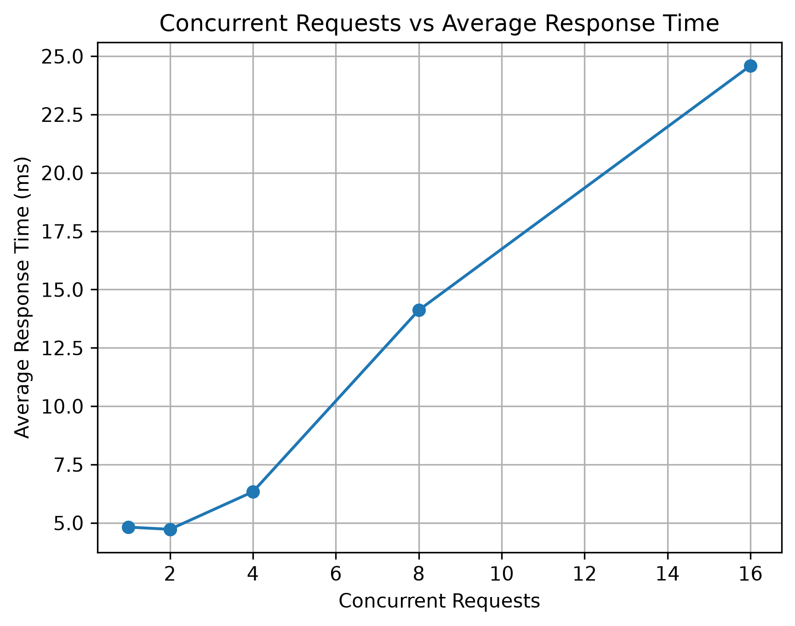
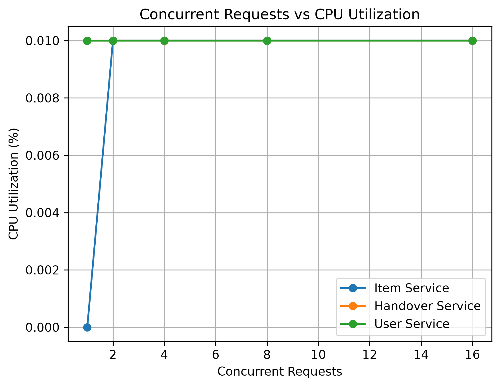
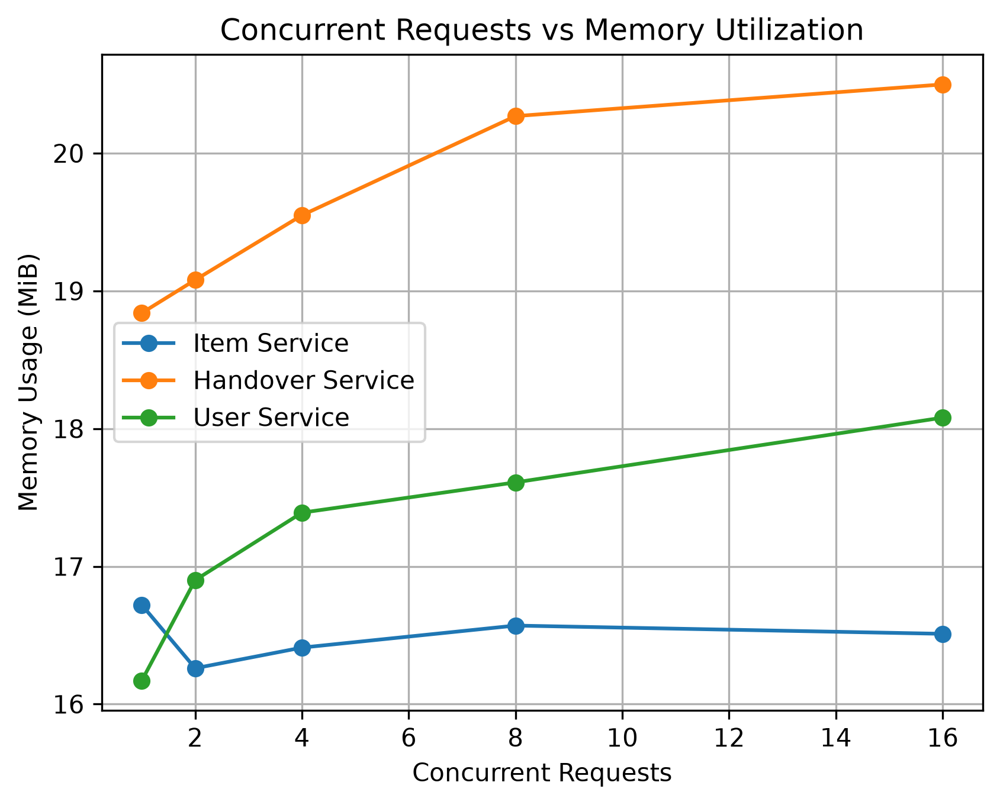

# Lost and Found Microservices Performance Analysis

A containerized Lost and Found application developed as a three-microservice system and evaluated under varying workloads.

This repository contains the **original PHP microservice implementation used for the performance experiment** and the **new Dockerized FastAPI implementation with Swagger/OpenAPI documentation, MySQL integration, and inter-service communication**.

## Project Overview

The application is divided into three independent services:

| Microservice | Responsibility | Original PHP Port | FastAPI Port |
|---|---|---:|---:|
| User Service | User-related operations | 8081 | 8001 |
| Item Service | Lost and found item operations | 8082 | 8002 |
| Handover Service | Item handover and return operations | 8083 | 8003 |

### Original PHP Implementation

The original implementation uses PHP 8.2 and Apache. These services were containerized with Docker Compose and used for the workload/performance experiment.

### New FastAPI Implementation

The new implementation is located in `fastapi-services/` and provides REST APIs, automatic Swagger documentation, MySQL connectivity, Dockerized deployment, and inter-service communication.

The existing PHP implementation and previous performance results are preserved.

## Architecture


### FastAPI Service Flow

```text
                    PHP Web Frontend / Client
                              |
                              | HTTP
                              v
                   +------------------------+
                   |      Item Service      |
                   |        FastAPI        |
                   |       Port 8002       |
                   +-----------+------------+
                               |
                    +----------+----------+
                    |                     |
                  HTTP                  HTTP
                    |                     |
                    v                     v
          +----------------+     +--------------------+
          |  User Service  |     | Handover Service   |
          |    FastAPI     |     |      FastAPI       |
          |    Port 8001   |     |      Port 8003     |
          +-------+--------+     +---------+----------+
                  |                        |
                  +-----------+------------+
                              |
                              v
                       MySQL Database
                     college_lost_found
```

Inside Docker, services communicate using service names:

```text
http://user-service:8000
http://item-service:8000
http://handover-service:8000
```

From the host machine:

```text
http://localhost:8001
http://localhost:8002
http://localhost:8003
```

## Technologies

| Technology | Purpose |
|---|---|
| PHP 8.2 | Original microservice implementation |
| Apache | Web server for original PHP services |
| Python | FastAPI implementation |
| FastAPI | REST API framework |
| Uvicorn | FastAPI application server |
| MySQL | Database |
| mysql-connector-python | MySQL connectivity |
| Requests | HTTP communication between services |
| Docker | Containerization |
| Docker Compose | Multi-container deployment |
| Docker Bridge Network | Inter-service communication |
| Swagger / OpenAPI | Interactive API documentation |
| ApacheBench | Workload generation |
| Pandas | Result data handling |
| Matplotlib | Graph generation |
| Git | Version control |
| GitHub | Repository hosting |

## Project Structure

```text
lostfound-microservices/
│
├── docker-compose.yml
├── README.md
│
├── user-service/                    # Original PHP service
│   ├── Dockerfile
│   └── index.php
├── item-service/                    # Original PHP service
│   ├── Dockerfile
│   └── index.php
├── handover-service/                # Original PHP service
│   ├── Dockerfile
│   └── index.php
│
├── results/
│   ├── workload_results.csv
│   ├── response_time.png
│   ├── throughput.png
│   ├── cpu_utilization.png
│   └── memory_utilization.png
│
└── fastapi-services/                # New FastAPI implementation
    ├── docker-compose.yml
    ├── user-service/
    │   ├── Dockerfile
    │   ├── main.py
    │   └── requirements.txt
    ├── item-service/
    │   ├── Dockerfile
    │   ├── main.py
    │   └── requirements.txt
    └── handover-service/
        ├── Dockerfile
        ├── main.py
        └── requirements.txt
```

# Original PHP Microservice Implementation

The original three services remain in the repository.

### User Service

```text
GET http://localhost:8081/
```

### Item Service

```text
GET http://localhost:8082/
```

### Handover Service

```text
GET http://localhost:8083/
```

Each original service uses PHP 8.2 with Apache and has its own Dockerfile.

```dockerfile
FROM php:8.2-apache

COPY index.php /var/www/html/index.php

EXPOSE 80
```

Original container mapping:

| Service | Container Name | Host Port | Container Port |
|---|---|---:|---:|
| User Service | lostfound-user | 8081 | 80 |
| Item Service | lostfound-item | 8082 | 80 |
| Handover Service | lostfound-handover | 8083 | 80 |

## FastAPI Microservices

The new FastAPI implementation is located in:

```text
fastapi-services/
```

There are exactly three independent FastAPI services.

### User Service

Manages user information stored in the MySQL `users` table.

| Method | Endpoint | Purpose |
|---|---|---|
| GET | `/users` | List users |
| GET | `/users/{user_id}` | Get one user's details |
| POST | `/users` | Create a new user |

Swagger:

```text
http://localhost:8001/docs
```

### Item Service

Manages lost and found item information stored in the MySQL `items` table.

| Method | Endpoint | Purpose |
|---|---|---|
| GET | `/items` | List items |
| GET | `/items/{item_id}` | Get one item |
| POST | `/items` | Create a new item |

Swagger:

```text
http://localhost:8002/docs
```

### Handover Service

Provides handover-related information.

| Method | Endpoint | Purpose |
|---|---|---|
| GET | `/handovers` | List handover details |
| GET | `/handovers/{item_id}` | Get handover details for an item |

Swagger:

```text
http://localhost:8003/docs
```

## FastAPI Database Configuration

The services use the existing MySQL database:

```text
Database: college_lost_found
User: root
```

For Docker execution, the services use:

```python
host="host.docker.internal"
```

so the containers can access MySQL running on the host machine.

## Swagger / OpenAPI Documentation

FastAPI automatically generates interactive API documentation.

| Service | Swagger URL |
|---|---|
| User Service | http://localhost:8001/docs |
| Item Service | http://localhost:8002/docs |
| Handover Service | http://localhost:8003/docs |

Swagger allows the evaluator to view endpoints, request bodies, parameters, and responses directly from the browser.

## FastAPI Docker Configuration

Each FastAPI service has its own Dockerfile and `requirements.txt`.

Typical Dockerfile:

```dockerfile
FROM python:3.13-slim

WORKDIR /app

COPY requirements.txt .
RUN pip install --no-cache-dir -r requirements.txt

COPY main.py .

EXPOSE 8000

CMD ["uvicorn", "main:app", "--host", "0.0.0.0", "--port", "8000"]
```

## FastAPI Docker Compose

Navigate to:

```powershell
cd C:\xampp2\htdocs\lostfound-microservices\fastapi-services
```

Build:

```powershell
docker compose build
```

Start:

```powershell
docker compose up -d
```

Check containers:

```powershell
docker ps
```

Expected FastAPI containers:

```text
fastapi-user
fastapi-item
fastapi-handover
```

Port mapping:

| Service | Host Port | Container Port |
|---|---:|---:|
| User Service | 8001 | 8000 |
| Item Service | 8002 | 8000 |
| Handover Service | 8003 | 8000 |

Stop:

```powershell
docker compose down
```

## Inter-Service Communication

The FastAPI Item Service communicates with the other services using Docker service names.

```text
Item Service
     |
     +---- HTTP ----> User Service
     |
     +---- HTTP ----> Handover Service
```

Examples:

```text
http://user-service:8000
http://handover-service:8000
```

This demonstrates service discovery and communication over the Docker network.

## Workload Testing Method

ApacheBench was used to generate workload against the **original PHP Item Service**.

Test endpoint:

```text
http://localhost:8082/
```

Command:

```powershell
& "C:\xampp2\apache\bin\ab.exe" -n 100 -c <concurrency> http://localhost:8082/
```

Each workload used 100 total requests.

| Workload | Concurrent Requests |
|---|---:|
| W1 | 1 |
| W2 | 2 |
| W3 | 4 |
| W4 | 8 |
| W5 | 16 |

Docker resource utilization was observed using Docker statistics.

> **Important:** The performance values below are the original measured PHP/Docker experiment results. They are not FastAPI benchmark values, because the FastAPI implementation was added after those measurements.

## Measured Performance Results

| Concurrent Requests | Avg Response Time (ms) | Throughput (req/s) | Failed Requests |
|---|---:|---:|---:|
| 1 | 4.817 | 207.59 | 0 |
| 2 | 4.724 | 423.35 | 0 |
| 4 | 6.332 | 631.76 | 0 |
| 8 | 14.116 | 566.73 | 0 |
| 16 | 24.594 | 650.55 | 0 |

## Container Resource Measurements

| Concurrent Requests | Item CPU (%) | Item Memory (MiB) | Handover CPU (%) | Handover Memory (MiB) | User CPU (%) | User Memory (MiB) |
|---|---:|---:|---:|---:|---:|---:|
| 1 | 0.00 | 16.72 | 0.01 | 18.84 | 0.01 | 16.17 |
| 2 | 0.01 | 16.26 | 0.01 | 19.08 | 0.01 | 16.90 |
| 4 | 0.01 | 16.41 | 0.01 | 19.55 | 0.01 | 17.39 |
| 8 | 0.01 | 16.57 | 0.01 | 20.27 | 0.01 | 17.61 |
| 16 | 0.01 | 16.51 | 0.01 | 20.50 | 0.01 | 18.08 |

## Performance Visualizations

### Average Response Time



### Throughput


### CPU Utilization



### Memory Utilization



## Result Analysis

### Response Time

Average response time was low at lower concurrency and increased with workload, reaching **24.594 ms** at 16 concurrent requests.

### Throughput

Throughput increased from **207.59 req/s** at one concurrent request to **631.76 req/s** at four concurrent requests. It varied at higher concurrency, showing that throughput does not necessarily increase linearly.

### Failed Requests

No failed requests were recorded at any of the five tested workload levels.

### CPU Utilization

CPU utilization remained very low, approximately **0.00–0.01%** in the captured Docker statistics.

### Memory Utilization

Memory remained comparatively stable. At 16 concurrent requests:

| Service | Memory |
|---|---:|
| Item Service | 16.51 MiB |
| Handover Service | 20.50 MiB |
| User Service | 18.08 MiB |

The Handover Service recorded the highest memory utilization in the measured observations.

## Result Files

```text
results/workload_results.csv
results/response_time.png
results/throughput.png
results/cpu_utilization.png
results/memory_utilization.png
```

## Verification Commands

Original PHP services:

```powershell
docker compose up -d
docker ps
docker network ls
```

FastAPI services:

```powershell
cd C:\xampp2\htdocs\lostfound-microservices\fastapi-services
docker compose up -d
docker ps
```

Stop FastAPI:

```powershell
docker compose down
```

## Experiment Outcome

The project demonstrates a complete three-microservice architecture with REST APIs, Docker containerization, Docker Compose deployment, Docker network communication, MySQL integration, Swagger documentation, inter-service HTTP communication, workload generation, resource monitoring, and performance analysis.

The original PHP implementation was used for the measured workload experiment, while the new FastAPI implementation provides a modern REST-based microservice layer with interactive Swagger documentation.

## Repository

GitHub:

https://github.com/sunayanakamat04/lostfound-microservices
