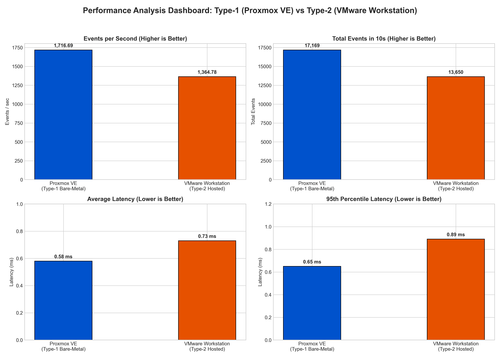

# Cloud Computing Lab — Hypervisor CPU Performance Study

## 1. Project Overview

This repository contains the practical work for a Cloud Computing / Computer Networks
laboratory experiment on CPU performance under two virtualization approaches:

- **Type-1:** Proxmox VE using KVM
- **Type-2:** VMware Workstation

The same general Ubuntu VM resource allocation was used for the comparison:
**2 vCPU, 2 GB RAM, and 20 GB virtual storage**. The CPU workload was measured with
Sysbench using the `--cpu-max-prime=20000` test.

The purpose is to record the measured benchmark output, visualize the results, and
discuss how the virtualization architecture can affect CPU throughput and latency.

---

## 2. What Was Tested

### Proxmox VE

Proxmox VE is used as the Type-1/bare-metal side of the experiment. The guest VM
runs through the Linux/KVM virtualization stack.

Simplified arrangement:

```text
Physical CPU / RAM / Storage
            │
            ▼
       Proxmox VE + KVM
            │
            ▼
       Ubuntu VM
            │
            ▼
       Sysbench CPU test
```

### VMware Workstation

VMware Workstation is used as the Type-2/hosted side. The virtualization software
runs on top of the Windows host operating system.

```text
Physical CPU / RAM / Storage
            │
            ▼
       Windows Host OS
            │
            ▼
    VMware Workstation
            │
            ▼
       Ubuntu VM
            │
            ▼
       Sysbench CPU test
```

---

## 3. VM Configuration

| Configuration | Proxmox VE | VMware Workstation |
|---|---|---|
| VM | CC-Experiment1-type1 | CC-Experiment1-Type2 |
| Guest OS | Ubuntu 24.04.3 LTS AMD64 | Ubuntu Linux 64-bit |
| vCPU | 2 | 2 |
| RAM | 2048 MiB | 2048 MB |
| Disk | 20 GB | 20 GB |
| Network | VirtIO / vmbr0 | NAT / VMnet8 |
| Benchmark | Sysbench CPU | Sysbench CPU |
| Prime limit | 20,000 | 20,000 |

The benchmark was intended to keep the main VM resource limits comparable between
the two environments.

---

## 4. Benchmark Method

The CPU workload was executed with:

```bash
sysbench cpu --cpu-max-prime=20000 run
```

Before the benchmark, the VM configuration and system state were checked using
commands such as:

```bash
hostnamectl
lscpu
free -h
df -h
top
```

The recorded measurements include:

- total execution time
- total events
- events per second
- minimum latency
- average latency
- maximum latency
- 95th-percentile latency

---

## 5. Recorded Benchmark Results

### Proxmox VE

| Metric | Result |
|---|---:|
| Events/sec | **1716.69** |
| Total time | **10.0004 s** |
| Total events | **17,169** |
| Minimum latency | **0.57 ms** |
| Average latency | **0.58 ms** |
| Maximum latency | **2.78 ms** |
| 95th percentile | **0.65 ms** |
| Latency sum | **9996.45 ms** |

### VMware Workstation

| Metric | Result |
|---|---:|
| Events/sec | **1364.78** |
| Total time | **10.0007 s** |
| Total events | **13,650** |
| Minimum latency | **0.67 ms** |
| Average latency | **0.73 ms** |
| Maximum latency | **4.06 ms** |
| 95th percentile | **0.89 ms** |
| Latency sum | **9992.11 ms** |

---

## 6. Side-by-Side Comparison

| Measurement | Proxmox VE | VMware Workstation | Difference |
|---|---:|---:|---:|
| Execution time | 10.0004 s | 10.0007 s | 0.0003 s |
| Total events | 17,169 | 13,650 | 3,519 |
| Events/sec | 1,716.69 | 1,364.78 | 351.91 |
| Minimum latency | 0.57 ms | 0.67 ms | 0.10 ms |
| Average latency | 0.58 ms | 0.73 ms | 0.15 ms |
| 95th percentile | 0.65 ms | 0.89 ms | 0.24 ms |
| Maximum latency | 2.78 ms | 4.06 ms | 1.28 ms |

For the measured run, the events-per-second values differ by approximately **25.78%**
when the Proxmox result is compared with the VMware result.

The benchmark also records lower latency values for the Proxmox run.

These numbers describe **this particular experiment**; they should not be treated as
a universal performance result for every Type-1 or Type-2 hypervisor.

---

## 7. Visual Results

The repository stores the generated charts in the `images` directory.

### CPU Throughput


This chart compares the number of benchmark events completed per second.

### Latency Metrics


This visualization compares minimum, average, 95th-percentile, and maximum latency.

### Total Events


This shows the total number of benchmark events completed during the test.

### Overall Dashboard



This combines the main measured performance indicators into one view.

---

## 8. Evidence

The raw experiment screenshots are stored separately in:

```text
images/
```

The repository currently contains:

```text
images/
├── Lab 1.jpeg
├── Lab 2.jpeg
├── events_per_second_comparison.png
├── latency_comparison.png
├── overall_performance_dashboard.png
└── total_events_comparison.png
```

The two Lab images provide the terminal/test evidence, while the PNG files are the
generated performance visualizations.

---

## 9. Why the Results Can Differ

A Type-1 and Type-2 setup have different software layers between the guest workload
and the physical machine.

In this experiment, VMware Workstation operates on top of a Windows host OS,
whereas Proxmox VE uses the KVM-based virtualization stack directly on the server
platform.

Possible sources of overhead include CPU scheduling, host resource contention,
virtualization management, and memory-address translation. The benchmark results
therefore provide a practical way to observe the effect of those layers under the
specific test conditions used here.

---

## 10. Scripts

The automation and analysis programs are stored in:

```text
script/
├── benchmark.sh
├── generate_plots.py
└── parse_sysbench.py
```

### Benchmark script

`benchmark.sh` is used for running the Sysbench CPU workload and recording its output.

### Plot generation

`generate_plots.py` creates the comparison figures used in the `images/` directory.

### Result parsing

`parse_sysbench.py` is used to process benchmark output and calculate comparison
values.

---

## 11. Repository Layout

```text
cloud computing/
│
├── Lab Report.md
│
├── images/
│   ├── Lab 1.jpeg
│   ├── Lab 2.jpeg
│   ├── events_per_second_comparison.png
│   ├── latency_comparison.png
│   ├── overall_performance_dashboard.png
│   └── total_events_comparison.png
│
└── script/
    ├── benchmark.sh
    ├── generate_plots.py
    └── parse_sysbench.py
```

---

## 12. Reproducing the Benchmark

Inside the Ubuntu VM, install Sysbench if required:

```bash
sudo apt update
sudo apt install sysbench -y
```

Run:

```bash
sysbench cpu --cpu-max-prime=20000 run
```

For the repository scripts, use the files under `script/` according to their
individual purpose.

---

## 13. Conclusion

This laboratory exercise demonstrates how the same CPU-oriented workload can produce
different measured results when executed in different virtualization environments.

For the recorded runs, Proxmox VE produced **1,716.69 events/sec**, while VMware
Workstation produced **1,364.78 events/sec**. The recorded average latencies were
**0.58 ms** and **0.73 ms**, respectively.

The experiment therefore provides a practical comparison of CPU throughput and
latency under the two tested virtualization setups.

> **Note:** The conclusions above are limited to the benchmark configuration and
> measurements recorded for this laboratory experiment.
